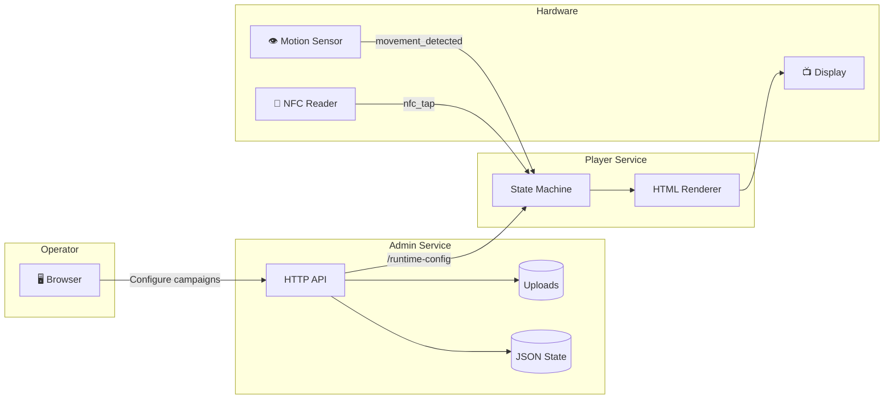
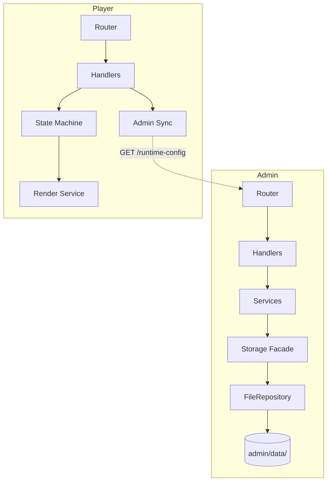
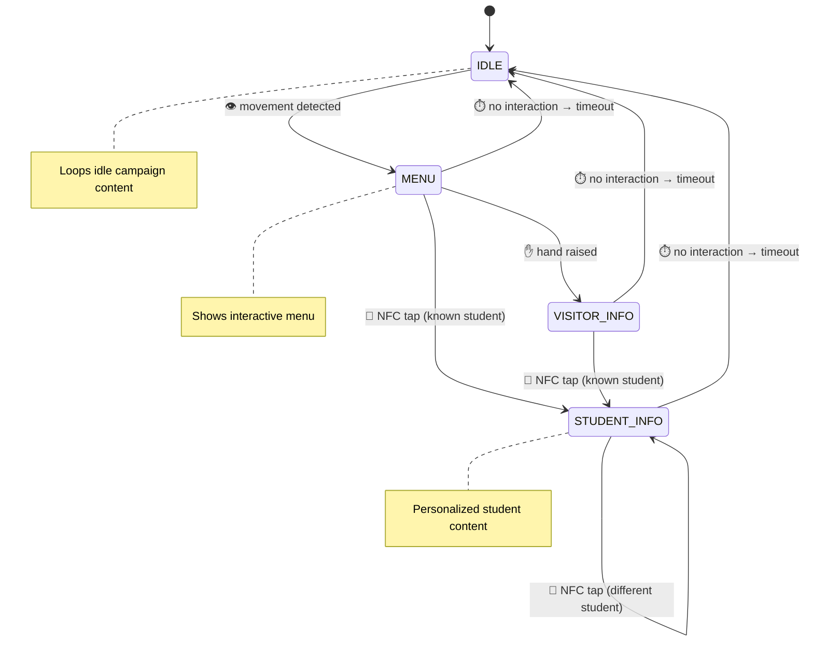
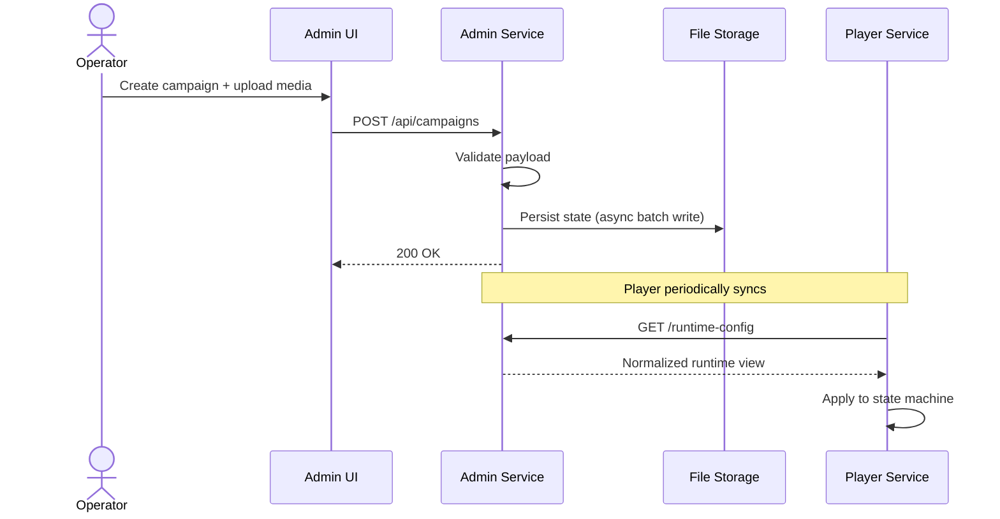
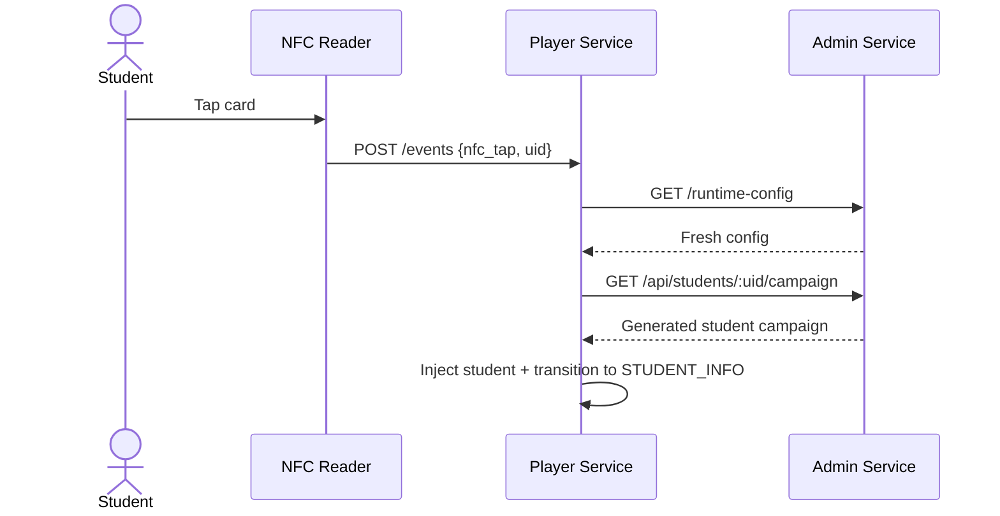
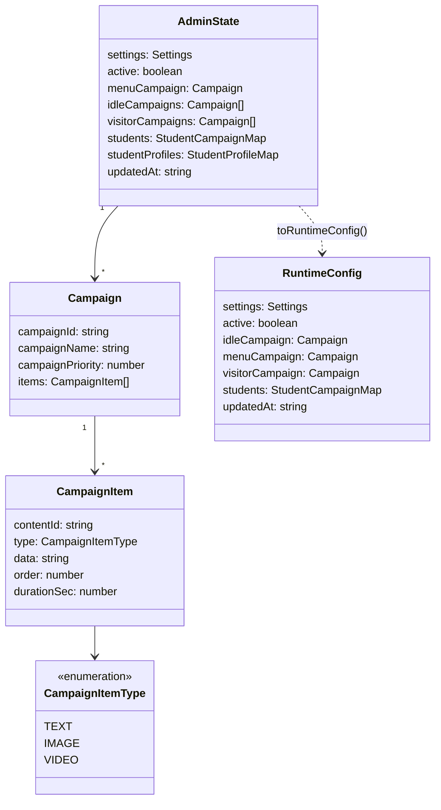
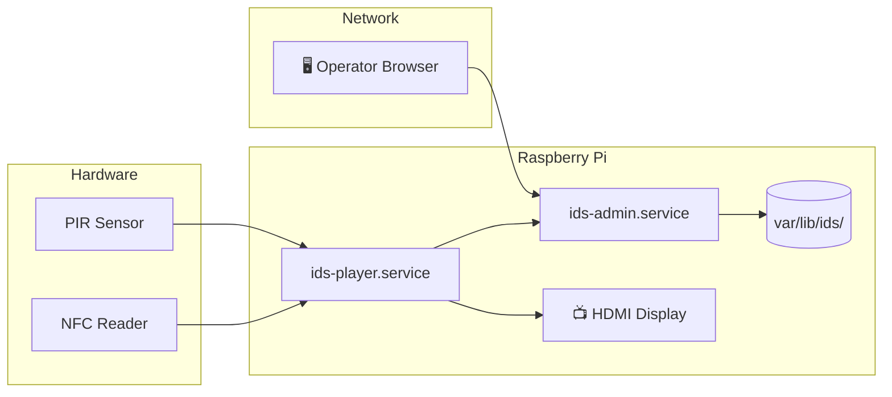

# IDS — Interactive Digital Signage

[](https://github.com/fergouchyahya/IDS/actions/workflows/ci.yml)

> A smart signage platform that reacts to people. Movement wakes it up, NFC identifies them, and the right content appears — all managed from a browser.

```
┌─────────────────────────────────────────────────────────────┐
│                                                             │
│    ┌──────────┐    HTTP    ┌──────────┐    Render    📺     │
│    │  Admin   │ ────────► │  Player  │ ──────────► Screen  │
│    │ Service  │ ◄──config─ │ Service  │                     │
│    └────┬─────┘           └────┬─────┘                     │
│         │                      │                            │
│    ┌────▼─────┐          ┌─────▼────┐                      │
│    │ Browser  │          │ Detector │                      │
│    │ Admin UI │          │ NFC/PIR  │                      │
│    └──────────┘          └──────────┘                      │
│                                                             │
└─────────────────────────────────────────────────────────────┘
```

---

## How It Works



**In plain words:**

1. Staff open the admin UI in a browser and set up what the screen should show
2. The admin service stores campaigns, student profiles, and media on disk
3. The player service pulls that config and renders a full-screen display
4. When someone walks by, the motion sensor wakes the screen to a menu
5. An NFC tap identifies a student and shows their personalized content
6. After a period of no interaction (no gesture or tap), the screen returns to idle

---

## Architecture

### Service Layering

Both services follow a clean layered architecture — no framework, just Node.js `http`:



### Admin — The Control Plane

| Layer | Role |
|-------|------|
| **Router** | URL + method dispatch only |
| **Handlers** | HTTP concerns — parse body, call service, map status codes |
| **Services** | Domain logic — campaigns, students, config, media, health |
| **Storage** | Validates data, manages state, generates runtime projections |
| **Repository** | File-backed persistence with async write batching |

### Player — The Display Runtime

| Layer | Role |
|-------|------|
| **Router** | Dispatches to handler by path |
| **Handlers** | Event ingestion, state queries, detector auth |
| **State Machine** | Tracks current screen state, manages transitions |
| **Render Service** | Generates full HTML pages with CSS, menus, debug controls |
| **Admin Sync** | Pulls live config + student campaigns from admin |

---

## Player State Machine

The heart of the player is a finite state machine that governs what appears on screen:



### Event Sources

| Source | Endpoint | Auth |
|--------|----------|------|
| UI / Manual | `POST /events` | None |
| Motion sensor | `POST /detector/movement` | Detector token |
| NFC reader | `POST /detector/events` | Detector token |
| Camera detector | `POST /detector/events` | Detector token (presence detection, does not reset timer) |

---

## Data Flow

### Content Publishing



### NFC Student Identification



---

## Campaign Model



---

## Project Structure

```
ids/
├── admin/                  Admin HTTP service
│   ├── src/
│   │   ├── handlers/       HTTP request handlers
│   │   ├── services/       Domain business logic
│   │   ├── storage/        Persistence layer + repository
│   │   └── utils/          Helpers
│   ├── public/             Browser admin UI
│   │   ├── components/     UI components
│   │   └── services/       Client-side services
│   ├── test/               Unit + integration tests
│   └── data/               Runtime data + uploads
│
├── player/                 Player display service
│   ├── src/
│   │   ├── handlers/       Event + state handlers
│   │   ├── services/       State machine, rendering, sync
│   │   └── detector/       Motion detection + NFC events
│   └── test/               Unit + integration tests
│
├── shared/                 Common code for both services
│   ├── config/             Environment variable parsing
│   ├── validation/         Field validators
│   ├── errors/             Error types
│   ├── utils/              HTTP helpers + logger
│   └── contract/           JSON schema + example configs
│
├── deploy/                 Raspberry Pi deployment
│   └── pi/
│       ├── env/            Environment template
│       ├── systemd/        Service unit files
│       └── smoke-check.sh  Health verification
│
├── docs/                   Full documentation set
├── scripts/                Repo verification helpers
├── .env.example            Environment template
└── Makefile                Build + run commands
```

---

## Quick Start

```bash
# Install all dependencies
make install

# Start the admin service (http://127.0.0.1:8081)
make run-admin

# Start the player with example config (http://127.0.0.1:7070)
make run-player

# Run all tests
make test

# Validate the JSON contract
make validate
```

### Environment

Copy `.env.example` and adjust as needed. Key variables:

| Variable | Default | Purpose |
|----------|---------|---------|
| `ADMIN_PORT` | `8081` | Admin service port |
| `PLAYER_PORT` | `7070` | Player service port |
| `IDS_CONFIG` | Example config path | Player startup config |
| `IDS_ADMIN_URL` | `http://127.0.0.1:8081` | Admin URL for player sync |
| `IDS_ADMIN_DATA_DIR` | `admin/data` | Persistent storage directory |
| `IDS_PUBLIC_ADMIN_URL` | Same as admin URL | Public URL for media references |
| `IDS_ADMIN_API_KEY` | `admin` | API key for admin mutations (empty = auth disabled) |
| `NFC_POLL_MS` | `800` | NFC reader polling interval (ms) |
| `NFC_COOLDOWN_MS` | `3000` | Minimum time between same NFC card taps (ms) |
| `LOG_LEVEL` | `info` | Logging verbosity |

---

## API Overview

All admin mutation endpoints (POST/PUT/DELETE) require an API key via `Authorization: Bearer <key>`. GET endpoints are public. See [Admin API Reference](docs/api/admin.md) for details.

### Admin Endpoints

| Method | Path | Auth | Purpose |
|--------|------|------|---------|
| `GET` | `/` | No | Serve admin UI |
| `GET` | `/health` | No | Service health check |
| `GET` | `/api/state` | No | Full admin state |
| `GET` | `/runtime-config` | No | Player runtime projection |
| `POST` | `/api/campaigns` | Yes | Create campaign |
| `PUT` | `/api/campaigns/:id` | Yes | Update campaign |
| `DELETE` | `/api/campaigns/:id` | Yes | Delete campaign |
| `POST` | `/api/menu-campaign` | Yes | Set menu campaign |
| `POST` | `/api/students` | Yes | Create/update student |
| `POST` | `/api/students/import` | Yes | Bulk import student profiles |
| `GET` | `/api/students/:uid/campaign` | No | Generated student campaign |
| `DELETE` | `/api/students/:uid` | Yes | Delete student |
| `POST` | `/api/media/upload` | Yes | Upload media file |
| `GET` | `/media/:filename` | No | Serve uploaded media |

### Player Endpoints

| Method | Path | Purpose |
|--------|------|---------|
| `GET` | `/` | Render display page |
| `GET` | `/current` | Current state snapshot |
| `GET` | `/health` | Service health check |
| `POST` | `/events` | General event ingestion |
| `POST` | `/detector/movement` | Motion detection (auth) |
| `POST` | `/detector/events` | Detector events (auth) |
| `POST` | `/runtime-config` | Push config update |

---

## Deployment

The system is designed to run on a **Raspberry Pi** connected to a display. See [docs/operations/deployment-pi.md](docs/operations/deployment-pi.md) for the full guide.



> **Note:** The operator browser accesses the admin interface via SSH tunnel — the admin service is bound to loopback on the Pi and is not exposed to the open network.

**Key paths on the Pi:**

| Path | Purpose |
|------|---------|
| `/opt/ids` | Application code |
| `/etc/ids/ids.env` | Environment config |
| `/var/lib/ids/admin` | Persistent state + uploads |
| `/var/log/ids` | Service logs |

---

## Tech Stack

| Area | Technology |
|------|------------|
| Runtime | Node.js (no framework — raw `http` module) |
| Language | JavaScript (CommonJS) |
| Frontend | Vanilla JS, HTML, CSS (no build step) |
| Persistence | JSON file (campaigns/settings) + SQLite via `better-sqlite3` (student profiles) |
| Validation | AJV (JSON Schema) |
| Auth | API key via `Authorization: Bearer` header on mutation endpoints |
| Testing | Node built-in test runner (`--test`) |
| CI | GitHub Actions (automated on push/PR) |
| Deployment | systemd on Raspberry Pi |
| Hardware | Raspberry Pi + PIR sensor + NFC reader + display |

---

## Testing

```bash
# Run all suites
make test-all

# Individual packages
npm --prefix admin test
npm --prefix player test
node --test shared/test/*.test.js

# Full verification
./scripts/verify-all.sh
```

All test suites pass in a normal local environment. Admin integration tests bind to `127.0.0.1` — restricted sandboxes may see `listen EPERM` failures even when the repo is healthy.

---

## Documentation

| Document | Description |
|----------|-------------|
| [Architecture Overview](docs/architecture/overview.md) | System-level design and data flow |
| [Admin Architecture](docs/architecture/admin.md) | Admin internals and layer breakdown |
| [Player Architecture](docs/architecture/player.md) | State machine, rendering, detector flow |
| [Shared Architecture](docs/architecture/shared.md) | Common utilities and contract |
| [Admin API Reference](docs/api/admin.md) | Full admin endpoint documentation |
| [Player API Reference](docs/api/player.md) | Full player endpoint documentation |
| [Local Development Guide](docs/operations/local-development.md) | Run and test on your laptop |
| [Deployment Guide](docs/operations/deployment-pi.md) | Raspberry Pi setup and operations |
| [Demo Script](docs/demo-script.md) | Step-by-step live demo walkthrough |
| [Testing Guide](docs/testing.md) | Test coverage and verification |
| [Glossary](docs/glossary.md) | Project terminology |
| [Status & Roadmap](docs/status.md) | Current state and next steps |
