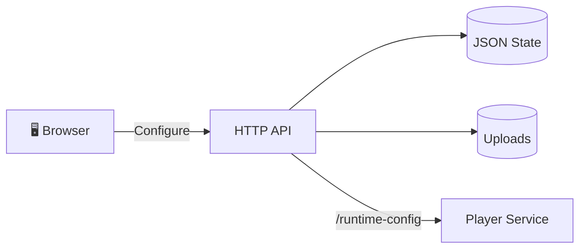

# Admin Service

> The IDS control plane — campaign management, student data, media uploads, and the browser UI.

---

## What It Does



- Stores campaigns, students, and settings on disk
- Serves the browser-based admin UI
- Exposes HTTP APIs for all management operations
- Projects a normalized runtime config for the player
- Handles media uploads and serving

---

## Quick Start

```bash
# From ids/ root
make run-admin            # Start on http://127.0.0.1:8081
npm --prefix admin test   # Run all tests
```

---

## Architecture

```
Router → Handler → Service → Storage → FileRepository → Disk
```

| Layer | Files | Role |
|-------|-------|------|
| Router | `src/router.js` | URL + method dispatch |
| Handlers | `src/handlers/*.js` | HTTP parsing, status codes |
| Services | `src/services/*.js` | Domain logic |
| Storage | `src/storage/storage.js` | State management + validation |
| Repository | `src/storage/repository.js` | JSON file persistence |

---

## Key Entrypoints

| File | Purpose |
|------|---------|
| [src/index.js](src/index.js) | Entry point — config + boot |
| [src/server.js](src/server.js) | Dependency assembly + HTTP server |
| [src/router.js](src/router.js) | Route table |

---

## Documentation

| Document | Description |
|----------|-------------|
| [Architecture](../docs/architecture/admin.md) | Layers, persistence, UI structure, media flow |
| [API Reference](../docs/api/admin.md) | Every endpoint with examples |
| [Testing](../docs/testing.md) | Test suites and coverage |
