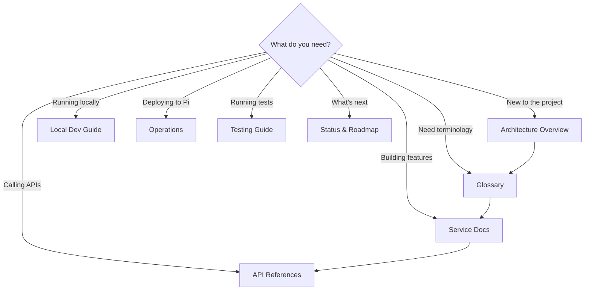

# IDS Documentation

> The canonical documentation set for the IDS workspace. Every file here describes the code as it actually exists — not a future plan.

---

## Where To Start



---

## Documentation Map

### Understanding The System

| Document | What You'll Learn |
|----------|-------------------|
| [Architecture Overview](architecture/overview.md) | How the whole system fits together — services, data flow, design rules |
| [Glossary](glossary.md) | Every term you'll encounter — campaigns, states, events, layers |

### Service Deep Dives

| Document | What You'll Learn |
|----------|-------------------|
| [Admin Architecture](architecture/admin.md) | The control plane — layers, persistence, browser UI, media flow |
| [Player Architecture](architecture/player.md) | The display runtime — state machine, events, rendering, NFC flow |
| [Shared Architecture](architecture/shared.md) | Common code — config, validation, errors, logging, contract |

### API References

| Document | What You'll Learn |
|----------|-------------------|
| [Admin API](api/admin.md) | Every admin endpoint — campaigns, students, media, config |
| [Player API](api/player.md) | Every player endpoint — display, events, detector, runtime config |

### Operations & Quality

| Document | What You'll Learn |
|----------|-------------------|
| [Local Development Guide](operations/local-development.md) | Run and test IDS on your laptop — setup, debug mode, simulating events |
| [Deployment Guide](operations/deployment-pi.md) | Raspberry Pi setup — systemd, env config, smoke checks, upgrades |
| [Demo Script](demo-script.md) | Step-by-step guide for running a live demo |
| [Testing Guide](testing.md) | Test suites, verification commands, coverage areas |
| [Status & Roadmap](status.md) | Current state, phased next steps, deferred work |

---

## Reading Order For Newcomers

```
1. architecture/overview.md          — the big picture
2. glossary.md                       — learn the vocabulary
3. architecture/admin.md             — how the control plane works
4. architecture/player.md            — how the display works
5. api/admin.md                      — admin HTTP surface
6. api/player.md                     — player HTTP surface
7. operations/local-development.md   — run and test on your laptop
8. operations/deployment-pi.md       — running it on real hardware
```

---

## Documentation Rules

- **Source-backed** — derive behavior from code, tests, env config, and deploy assets
- **Single source of truth** — one status tracker ([status.md](status.md)), no competing roadmaps
- **Update, don't duplicate** — when code changes, update the existing doc
- **Delete stale content** — if an old file stops matching reality, merge useful bits and remove it
