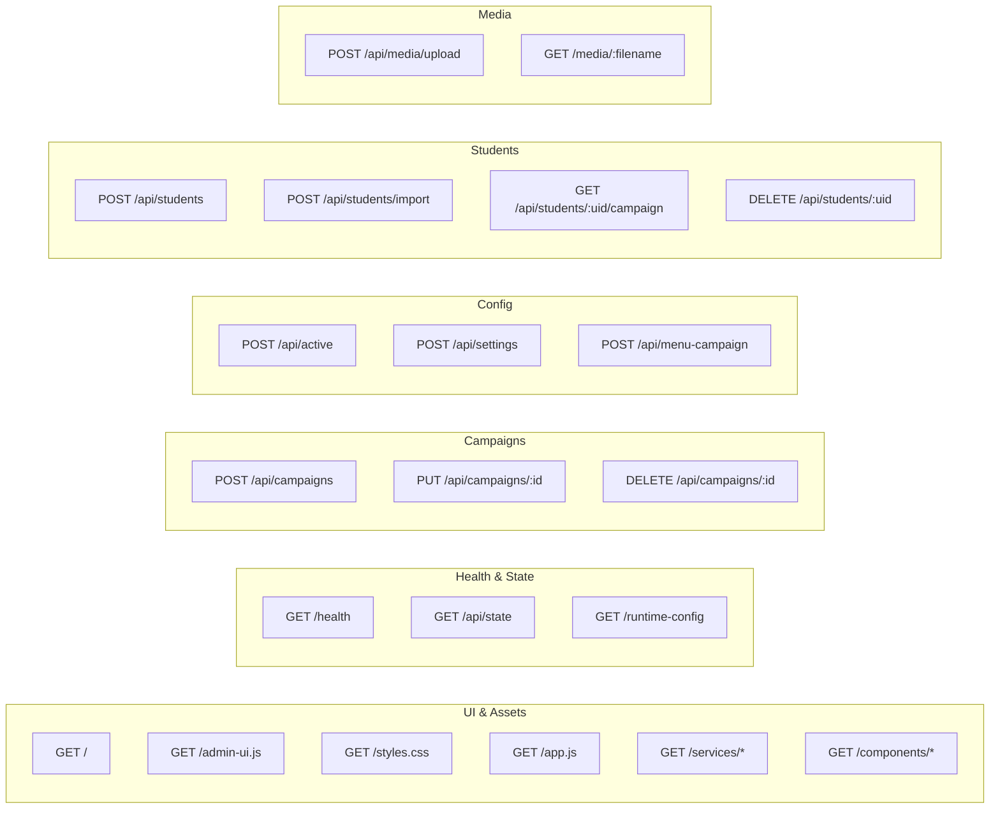
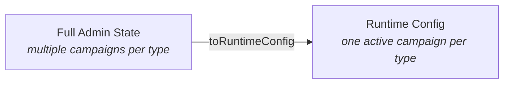

# Admin API Reference

> Every HTTP endpoint the admin service exposes.

---

## Overview



## Contract Policy

- Validation errors return `{ error: "validation_failed", issues: [...] }`
- Unknown routes return `404 { error: "not_found: /path" }`
- Successful mutations return `{ state }` with the full updated admin state

---

## UI & Static Assets

### `GET /`

Serves the admin HTML shell.

| Field | Value |
|-------|-------|
| Handler | `handlers/ui.js` |
| Response | `200 text/html` |

### `GET /admin-ui.js` · `GET /app.js` · `GET /styles.css`

Serve the main browser scripts and styles.

| Field | Value |
|-------|-------|
| Handler | `handlers/ui.js` |
| Response | `200` with appropriate content type |

### `GET /services/*` · `GET /components/*`

Serve extracted browser-side service and component modules.

---

## Health & State

### `GET /health`

Service and storage health.

```json
{
  "status": "ok",
  "timestamp": "2026-03-13T10:00:00.000Z",
  "uptimeMs": 86400000,
  "storage": { "status": "ok" }
}
```

### `GET /api/state`

The full persisted admin state plus generated student campaigns.

```json
{
  "state": {
    "settings": { ... },
    "active": { "idleCampaignId": "...", "visitorCampaignId": "..." },
    "menuCampaign": { ... },
    "idleCampaigns": [ ... ],
    "visitorCampaigns": [ ... ],
    "students": { ... },
    "studentProfiles": { ... },
    "generatedStudentCampaigns": { ... },
    "updatedAt": "2026-03-13T10:00:00.000Z"
  }
}
```

### `GET /runtime-config`

The normalized projection consumed by the player.

```json
{
  "settings": { ... },
  "active": { ... },
  "idleCampaign": { ... },
  "menuCampaign": { ... },
  "visitorCampaign": { ... },
  "students": { ... },
  "updatedAt": "2026-03-13T10:00:00.000Z"
}
```



---

## Campaign Management

### `POST /api/campaigns`

Create a new idle or visitor campaign.

**Request body:**
```json
{
  "kind": "idle | visitor",
  "campaignName": "Welcome Loop",
  "items": [
    {
      "contentId": "item-1",
      "type": "TEXT",
      "data": "Welcome to our school!",
      "order": 1,
      "durationSec": 5
    }
  ]
}
```

**Response:** `201 { state }`

### `PUT /api/campaigns/:id`

Update an existing campaign's name and/or items.

**Response:** `200 { state }`

### `DELETE /api/campaigns/:id`

Delete a campaign. Repairs active selections if the deleted campaign was active.

**Response:** `200 { state }`

---

## Active Config & Settings

### `POST /api/active`

Set which idle and visitor campaigns are active.

**Request body:**
```json
{
  "idleCampaignId": "campaign-uuid",
  "visitorCampaignId": "campaign-uuid"
}
```

**Response:** `200 { state }`
**Error:** `404` if referenced campaign doesn't exist

### `POST /api/settings`

Update global settings.

**Request body:**
```json
{
  "inactivityTimeoutMs": 30000
}
```

**Response:** `200 { state }`

### `POST /api/menu-campaign`

Replace the menu campaign.

**Request body:**
```json
{
  "campaignName": "Main Menu",
  "items": [ ... ]
}
```

**Response:** `200 { state }`

---

## Student Data

### `POST /api/students`

Create or replace a manual student-to-campaign mapping.

**Request body:**
```json
{
  "nfcUid": "ABC123",
  "name": "Alice",
  "items": [ ... ]
}
```

**Response:** `200 { state }`

### `POST /api/students/import`

Bulk import student profiles for auto-generated campaigns.

**Request body:**
```json
{
  "students": [
    {
      "nfcUid": "ABC123",
      "displayName": "Alice",
      "timetableImageUrl": "/media/timetable-alice.png",
      "nextClassText": "Math — Room 204"
    }
  ]
}
```

**Response:** `200 { state, imported }`

### `GET /api/students/:uid/campaign`

Get a generated campaign for a student profile.

**Response:**
```json
{
  "nfcUid": "ABC123",
  "name": "Alice",
  "campaign": { ... }
}
```

**Error:** `404` if UID not found in profiles

### `DELETE /api/students/:uid`

Remove a manual student mapping.

**Response:** `200 { state }`

---

## Media

### `POST /api/media/upload`

Upload a file via `multipart/form-data`.

**Response:** `201` with upload metadata
**Error:** `400` with `invalid_content_type` if not multipart

### `GET /media/:filename`

Serve an uploaded file.

**Response:** Binary body with `Content-Type`, `Content-Length`, cache headers
**Errors:**
- `400` — invalid path
- `404` — file not found

---

## Validation Rules

Campaign items are validated with these constraints:

| Rule | Constraint |
|------|-----------|
| Items | At least one required |
| `contentId` | Unique within campaign |
| `type` | `TEXT`, `IMAGE`, or `VIDEO` |
| `order` | Integer >= 1 |
| `durationSec` | Integer >= 1 |
| `data` | Non-empty string |
| Image/profile URLs | Must be `/media/*` or `http(s)://...` |

Full rules: `admin/src/storage/validators.js`

---

## Related Docs

| Document | Description |
|----------|-------------|
| [Admin Architecture](../architecture/admin.md) | Internal layers and design |
| [Player API](player.md) | The other service's endpoints |
| [Architecture Overview](../architecture/overview.md) | System-level view |
