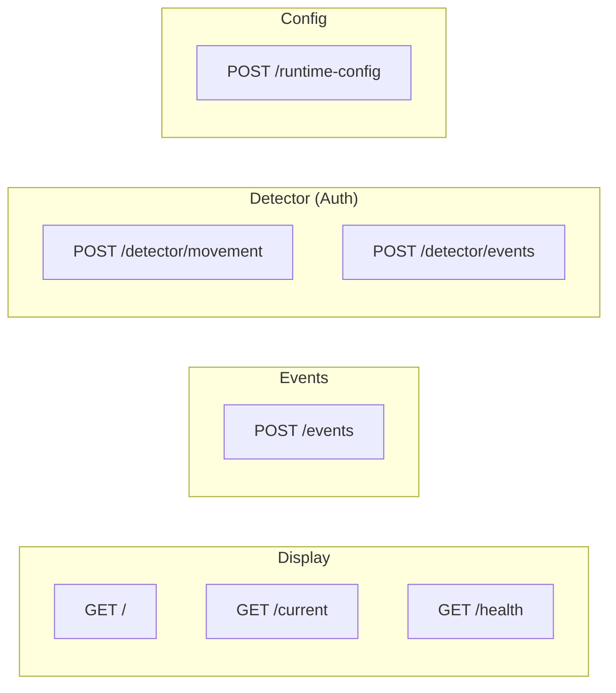
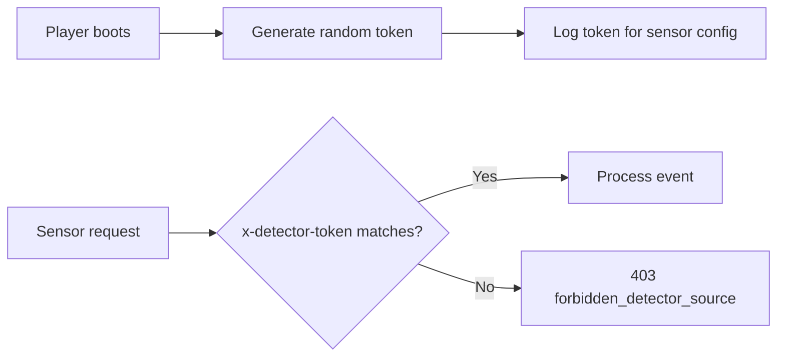
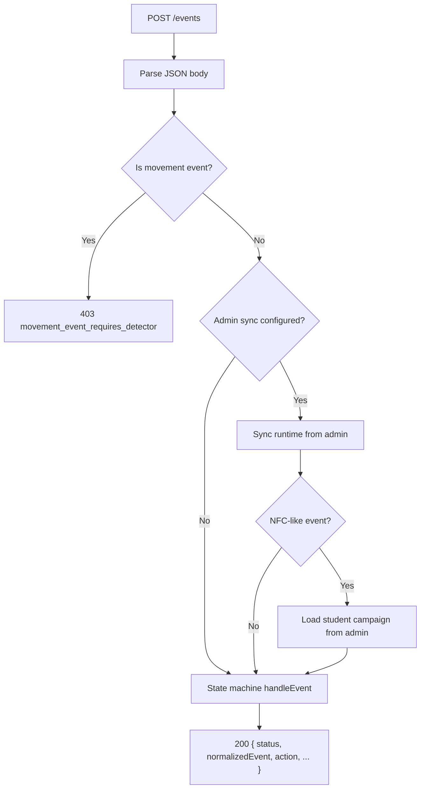
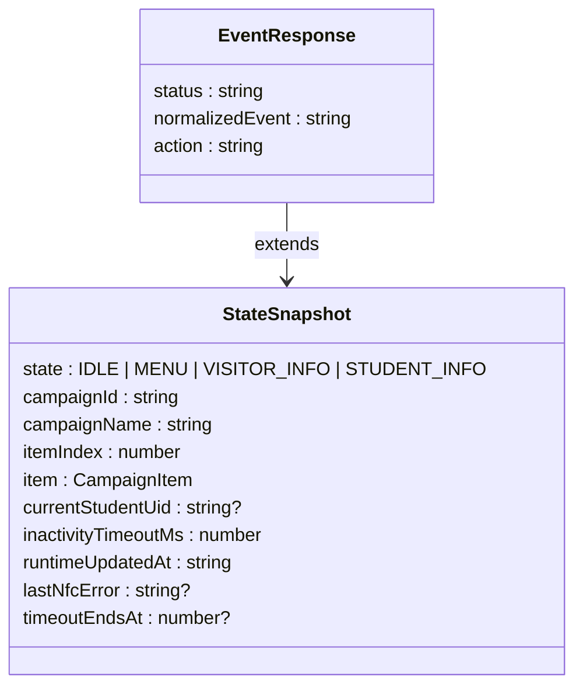

# Player API Reference

> Every HTTP endpoint the player service exposes.

---

## Overview



## Contract Policy

- Unknown routes return `404 { error: "not_found" }`
- The API is state-oriented — responses describe the current in-memory state
- Detector endpoints require auth, general events do not
- Movement events are **only** accepted through detector endpoints

---

## Authentication

Detector endpoints require a token generated at boot time:

```
Header:  x-detector-token: <random-token>
```



---

## Display & Status

### `GET /`

Render the current signage page as full-screen HTML.

| Field | Value |
|-------|-------|
| Handler | `handlers/ui.js` |
| Query | `?debug=1` — force debug UI |
| Response | `200 text/html` |

### `GET /current`

The current state machine snapshot.

```json
{
  "state": "MENU",
  "campaignId": "campaign-uuid",
  "campaignName": "Main Menu",
  "itemIndex": 0,
  "item": { "contentId": "...", "type": "TEXT", "data": "..." },
  "currentStudentUid": null,
  "inactivityTimeoutMs": 30000,
  "runtimeUpdatedAt": "2026-03-13T10:00:00.000Z",
  "lastNfcError": null,
  "timeoutEndsAt": 1711036800000
}
```

### `GET /health`

Service health with runtime state and admin sync status.

```json
{
  "status": "ok",
  "timestamp": "2026-03-13T10:00:00.000Z",
  "uptimeMs": 3600000,
  "runtime": { "state": "IDLE", "campaignId": "..." },
  "adminSync": { "configured": true, "lastSync": "..." }
}
```

---

## General Event Ingestion

### `POST /events`

Accept manual or UI-triggered events. This is the main endpoint for non-sensor events.

**Request body:**
```json
{
  "type": "nfc_tap",
  "nfcUid": "ABC123"
}
```

**Behavior flow:**



**Success response:**
```json
{
  "status": "STUDENT_INFO",
  "normalizedEvent": "nfc_tap",
  "action": "transition",
  "campaignId": "...",
  "campaignName": "...",
  "itemIndex": 0,
  "currentStudentUid": "ABC123"
}
```

### Event Aliases

The state machine normalizes event names automatically:

| Input | Normalized To |
|-------|--------------|
| `movement`, `vision_present` | `movement_detected` |
| `visitor_detected` | `visitor_selected` |
| `nfc` | `nfc_tap` |
| `right_hand_move` | `scroll_next` |
| `left_hand_move` | `scroll_prev` |
| `presence_keepalive` | `presence_keepalive` |

---

## Detector Endpoints

### `POST /detector/movement`

Specialized motion endpoint. Always emits `movement_detected`.

**Request body (optional):**
```json
{
  "confidence": 0.95
}
```

**Flow:**
1. Validate `x-detector-token`
2. Parse body
3. Optionally sync runtime from admin
4. Send `movement_detected` to state machine

### `POST /detector/events`

Authenticated endpoint for other detector events (NFC, gestures, etc.).

**Request body:**
```json
{
  "type": "nfc_tap",
  "nfcUid": "ABC123"
}
```

**Allowed event types** are filtered by `player/src/detector/event-utils.js`: `movement_detected`, `visitor_selected`, `scroll_next`, `scroll_prev`, `nfc_tap`, `presence_keepalive`.

**Errors:**
- `403` — wrong or missing detector token
- `400 { error: "invalid_detector_event_type" }` — unsupported event type

---

## Runtime Config

### `POST /runtime-config`

Push a new runtime config directly to the player (replaces current in-memory config).

**Request body:** A valid runtime config object.

**Success:** `200 { status: "ok", current: <state snapshot> }`
**Error:** `400 { error: "invalid_runtime_config" }`

---

## State Snapshot Shape

The core snapshot returned by `/current` and embedded in event responses:



---

## Error Summary

| Scenario | Status | Error |
|----------|--------|-------|
| Movement via `/events` | `403` | `movement_event_requires_detector` |
| Wrong detector token | `403` | `forbidden_detector_source` |
| Unsupported detector event | `400` | `invalid_detector_event_type` |
| Invalid runtime config | `400` | `invalid_runtime_config` |
| Unknown route | `404` | `not_found` |

---

## Operational Notes

- Player binds to `127.0.0.1` by default — set `PLAYER_HOST=0.0.0.0` for network access
- When `IDS_ADMIN_URL` is configured, the player syncs runtime config from admin on events
- Student campaigns are loaded lazily from admin during NFC interactions
- `lastNfcError` is set to `"card_not_recognized"` when an unknown NFC card is tapped; the render service shows a warning banner on the menu page. Cleared on next successful event.
- `timeoutEndsAt` is a Unix timestamp (ms) indicating when the inactivity timer will fire. The client uses this to show a countdown toast when less than 5 seconds remain. `null` when in IDLE or no timer is active.
- `presence_keepalive` events are sent automatically by the browser detector every 3 seconds while someone is in front of the camera in a non-IDLE state. They are acknowledged but do **not** reset the inactivity timer — only real interactions (gestures, NFC taps, scrolls) reset it. This ensures the display returns to IDLE after a period of no interaction, even if someone is still standing in front of the camera.
- When a student taps the same NFC card while already viewing their STUDENT_INFO, the state machine treats it as a keepalive (action: `nfc_keepalive`) — the carousel position is preserved but the inactivity timer is **not** reset.

---

## Related Docs

| Document | Description |
|----------|-------------|
| [Player Architecture](../architecture/player.md) | State machine, rendering, detector flow |
| [Admin API](admin.md) | The other service's endpoints |
| [Architecture Overview](../architecture/overview.md) | System-level view |
