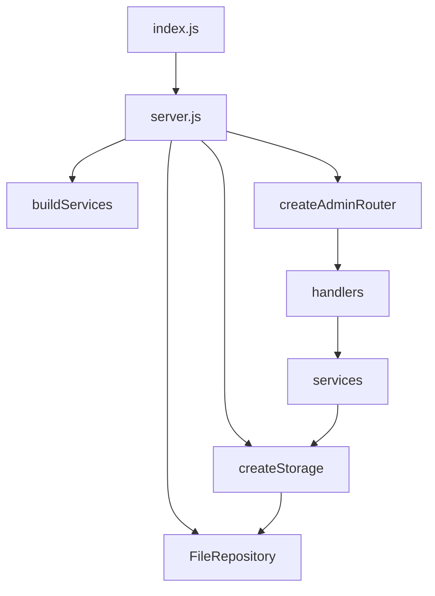
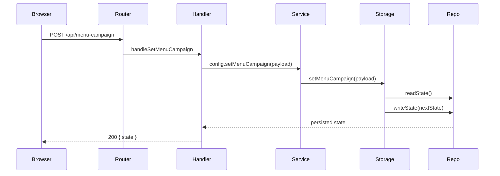

# Admin Architecture

This document explains how the admin service is wired and how it turns operator actions into persisted state and player runtime config.

## Purpose

The admin service is the control plane for IDS. It owns:

- the admin HTTP API
- the browser admin UI
- campaign and student data persistence
- uploaded media files
- runtime-config projection for the player

## Composition Root

The runtime starts here:

1. [`admin/src/index.js`](/home/fergyah/School/S8/PROJ/Project/ids/admin/src/index.js) reads config and validates `ADMIN_PORT`.
2. [`admin/src/server.js`](/home/fergyah/School/S8/PROJ/Project/ids/admin/src/server.js) builds dependencies.
3. `server.js` creates:
   - a `FileRepository`
   - the storage facade from `createStorage`
   - request body readers
   - domain services
   - the router
4. The HTTP server listens on `127.0.0.1`.



## Layer Responsibilities

### Router

[`admin/src/router.js`](/home/fergyah/School/S8/PROJ/Project/ids/admin/src/router.js) performs URL and method dispatch only. It does not validate business data or mutate state itself.

### Handlers

`admin/src/handlers/*` own HTTP concerns:

- read request body
- extract route params
- call the right service
- map success to HTTP status codes
- map validation failures through `sendValidationError`

### Services

`admin/src/services/*` are thin domain APIs. They keep handlers from talking directly to storage details:

- `campaign-service.js`
- `config-service.js`
- `student-service.js`
- `state-service.js`
- `health-service.js`
- `media-service.js`

### Storage

[`admin/src/storage.js`](/home/fergyah/School/S8/PROJ/Project/ids/admin/src/storage.js) is the main domain boundary for persisted admin state. It:

- validates campaign and student payloads
- manages the full state object
- updates active campaign selections
- generates runtime-config projections
- exposes generated student campaigns from profile data

### Repository

The repository boundary is defined by [`admin/src/storage/admin-repository.js`](/home/fergyah/School/S8/PROJ/Project/ids/admin/src/storage/admin-repository.js).

The current implementation is [`admin/src/storage/repository.js`](/home/fergyah/School/S8/PROJ/Project/ids/admin/src/storage/repository.js), which:

- persists state to a JSON file in the admin data directory
- batches async writes
- serves reads from in-memory cached state
- reports storage health

## Persistent State Model

The admin state includes:

- `settings`
- `active`
- `menuCampaign`
- `idleCampaigns`
- `visitorCampaigns`
- `students`
- `studentProfiles`
- `updatedAt`

Important distinction:

- `students` stores manual student-to-campaign mappings
- `studentProfiles` stores profile-style student data used to generate campaigns on demand

## Runtime Projection

The player does not consume the full admin state. Instead, admin maps it to a runtime view through [`admin/src/storage/runtime-mapper.js`](/home/fergyah/School/S8/PROJ/Project/ids/admin/src/storage/runtime-mapper.js).

That projection returns:

- `settings`
- `active`
- `idleCampaign`
- `menuCampaign`
- `visitorCampaign`
- `students`
- `updatedAt`

Generated student campaigns are exposed separately through `/api/students/:uid/campaign`.

```mermaid
flowchart LR
    State[Full admin state] --> Mapper[toRuntimeConfig]
    Mapper --> Runtime[Player runtime config]
    Profiles[studentProfiles] --> Generated[Generated student campaign]
    Generated --> StudentEndpoint[/api/students/:uid/campaign]
```

## Browser UI Structure

The browser UI is served from `admin/public/`.

Important files:

- [`admin/public/index.html`](/home/fergyah/School/S8/PROJ/Project/ids/admin/public/index.html)
- [`admin/public/admin-ui.js`](/home/fergyah/School/S8/PROJ/Project/ids/admin/public/admin-ui.js)
- [`admin/public/app.js`](/home/fergyah/School/S8/PROJ/Project/ids/admin/public/app.js)
- `admin/public/services/*`
- `admin/public/components/*`
- [`admin/public/styles.css`](/home/fergyah/School/S8/PROJ/Project/ids/admin/public/styles.css)

Current shape:

- `admin-ui.js` is still a large orchestration file
- several responsibilities have already been extracted into service/component modules
- the server exposes `/admin-ui.js`, `/app.js`, `/styles.css`, `/services/*`, and `/components/*`

## Media Flow

Media uploads go through `POST /api/media/upload`.

The flow is:

1. `media.js` checks `multipart/form-data`
2. raw body is read with upload-size limits
3. `media-service.js` delegates to multipart processing helpers
4. files are written under `<dataDir>/uploads`
5. media is later served from `GET /media/:filename`

Generated media URLs depend on `IDS_PUBLIC_ADMIN_URL`.

## End-To-End Example

### Operator publishes content for the player



## Failure Modes To Understand

- invalid JSON returns validation-style errors through shared helpers
- missing campaigns or students return `not_found` issues
- invalid uploads return validation errors such as `invalid_content_type`
- top-level unhandled request failures are trapped in `server.js` and return `500 { error: "internal_error" }`

## Related Docs

- Admin API details: [`../api/admin.md`](/home/fergyah/School/S8/PROJ/Project/ids/docs/api/admin.md)
- Shared config and helpers: [`shared.md`](/home/fergyah/School/S8/PROJ/Project/ids/docs/architecture/shared.md)
- Deployment and data directories: [`../operations/deployment-pi.md`](/home/fergyah/School/S8/PROJ/Project/ids/docs/operations/deployment-pi.md)
