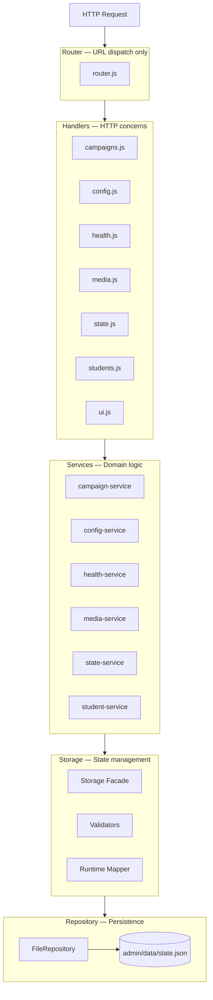
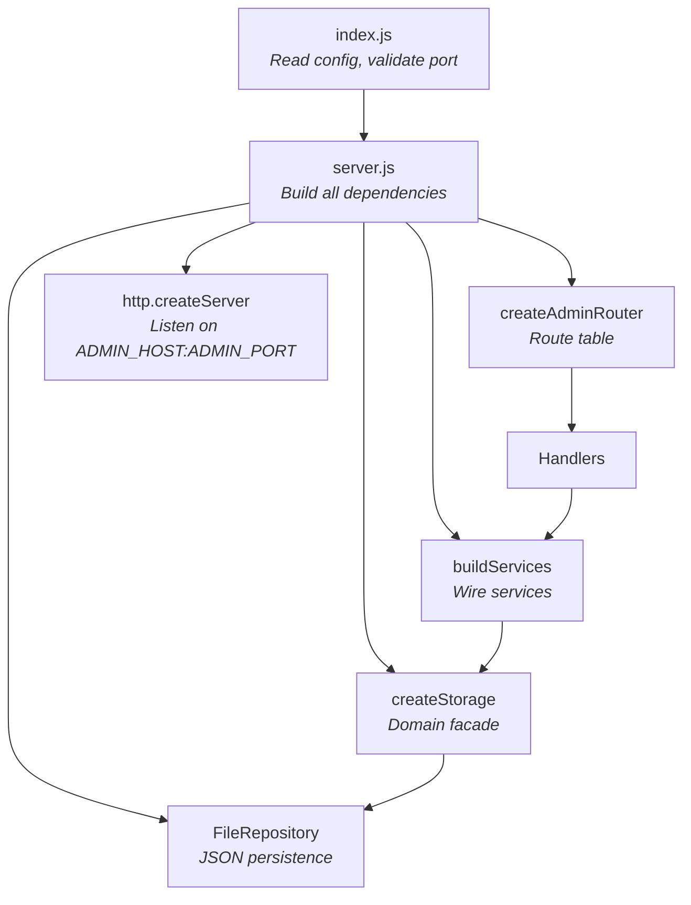
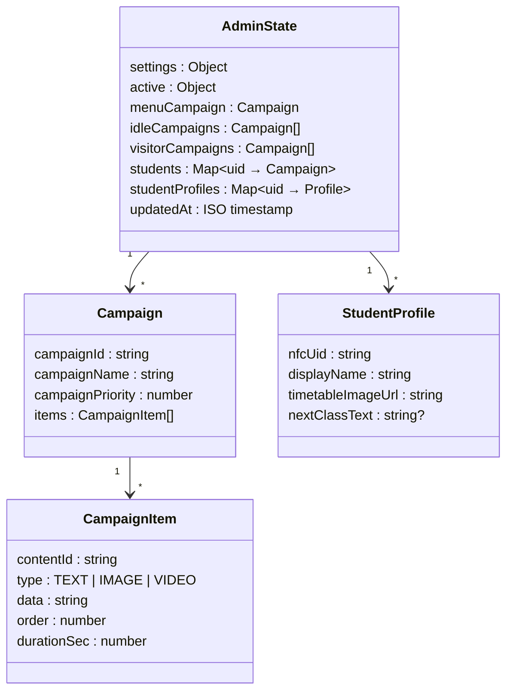
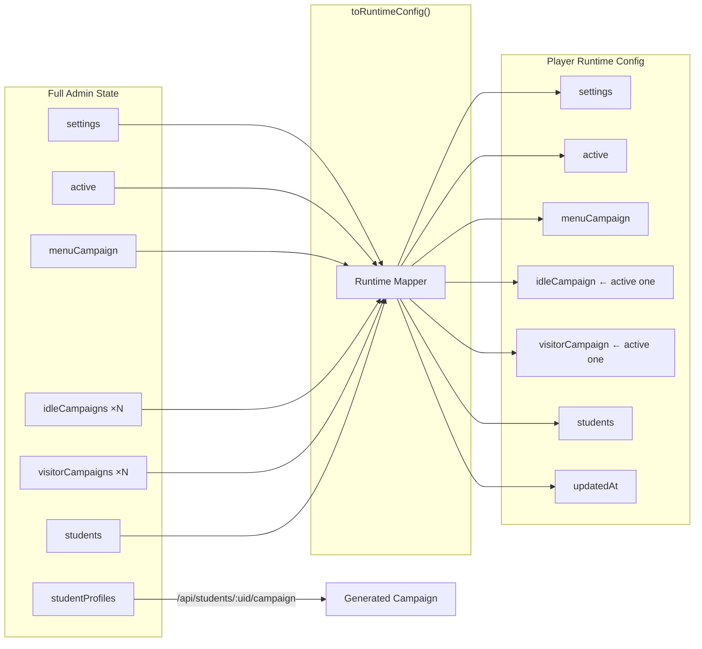
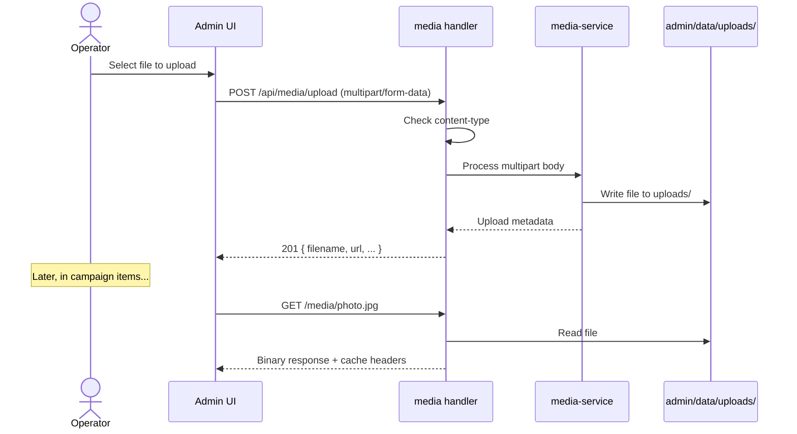
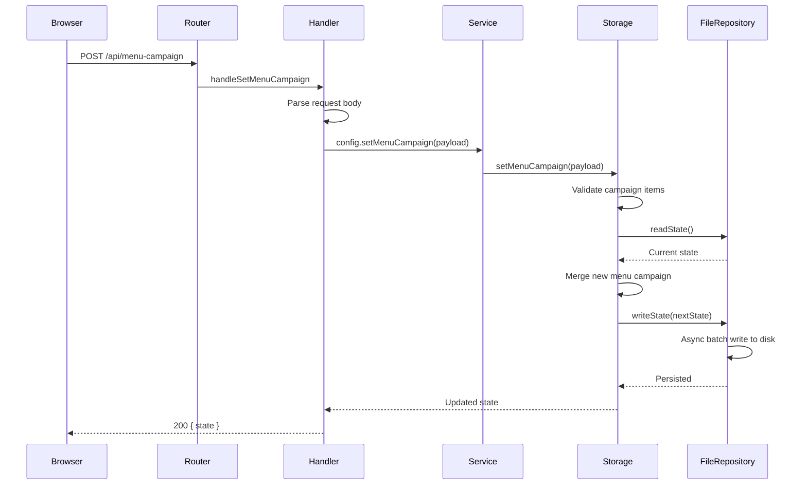

# Admin Architecture

> The control plane for IDS — where staff configure what the screen shows.

---

## What Admin Owns

```
┌─────────────────────────────────────────┐
│              Admin Service              │
├─────────────────────────────────────────┤
│  HTTP API for campaign management       │
│  Browser-based admin UI                 │
│  Campaign & student data persistence    │
│  Media file upload & serving            │
│  Runtime config projection for player   │
└─────────────────────────────────────────┘
```

---

## Layered Architecture

Every request flows through clean, separated layers:



### Layer Contracts

| Layer | Responsibility | Does NOT do |
|-------|---------------|-------------|
| **Router** | URL + method matching | Validate data, mutate state |
| **Handlers** | Parse body, call service, map HTTP status | Business logic |
| **Services** | Domain operations, orchestration | Direct disk I/O |
| **Storage** | Validate, manage state, project runtime config | HTTP concerns |
| **Repository** | Read/write JSON file, async batching | Business validation |

---

## Composition Root



---

## Persistent State Model

The admin state is a single JSON object persisted to disk:



**Key distinction:**
- `students` — manual student-to-campaign mappings (operator creates the campaign)
- `studentProfiles` — profile data used to **generate** campaigns on demand

---

## Runtime Projection

The player never sees the full admin state. Instead, a mapper creates a normalized view:



The player gets:
- **One** active idle campaign (not all of them)
- **One** active visitor campaign (not all of them)
- The menu campaign as-is
- Student mappings as-is
- Generated student campaigns via a separate endpoint

---

## Media Flow



Media URLs depend on `IDS_PUBLIC_ADMIN_URL` — if it points at the wrong hostname, media links break for external clients.

---

## Browser UI Structure

```
admin/public/
├── index.html          HTML shell
├── admin-ui.js         Main orchestration (large, being decomposed)
├── app.js              App initialization
├── styles.css          Styling
├── components/         Extracted UI components
│   ├── campaign-editor.js
│   ├── campaign-list.js
│   ├── student-manager.js
│   └── media-uploader.js
└── services/           Extracted browser-side services
    ├── api-client.js
    ├── state-manager.js
    ├── validation.js
    └── ...
```

The UI is **vanilla JavaScript** — no framework, no build step. The server serves these files directly.

---

## End-to-End: Publishing Content



---

## Error Handling

| Scenario | Response |
|----------|----------|
| Invalid JSON body | `400 { error: "validation_failed", issues: [...] }` |
| Missing campaign/student | `404 { error: "validation_failed", issues: ["not_found"] }` |
| Invalid upload content-type | `400 { error: "validation_failed", issues: ["invalid_content_type"] }` |
| Unknown route | `404 { error: "not_found: /path" }` |
| Unhandled server error | `500 { error: "internal_error" }` |

---

## Related Docs

| Document | Description |
|----------|-------------|
| [Admin API Reference](../api/admin.md) | Every endpoint in detail |
| [Shared Architecture](shared.md) | Config, validation, helpers used by admin |
| [Deployment Guide](../operations/deployment-pi.md) | Running admin on the Pi |
| [Architecture Overview](overview.md) | The full system view |
