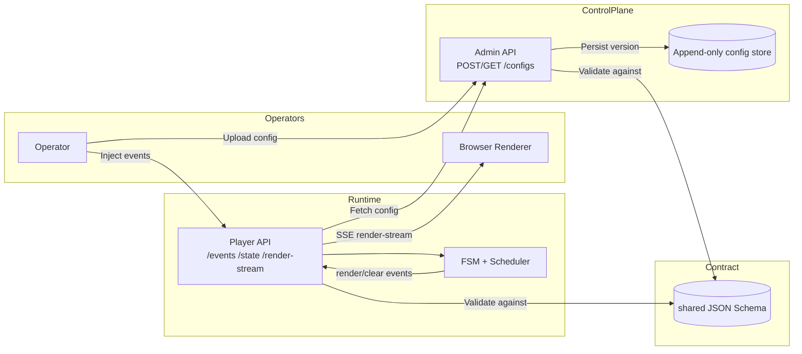

# Current System Flow

```mermaid
flowchart LR
  subgraph Operators
    OP[Operator]
    BR[Browser Renderer]
  end

  subgraph ControlPlane
    ADM[Admin API\nPOST/GET /configs]
    STORE[(Append-only config store)]
  end

  subgraph Runtime
    PLY[Player API\n/events /state /render-stream]
    FSM[FSM + Scheduler]
  end

  subgraph Contract
    SCH[(shared JSON Schema)]
  end

  OP -->|Upload config| ADM
  ADM -->|Validate against| SCH
  ADM -->|Persist version| STORE
  PLY -->|Fetch config| ADM
  PLY -->|Validate against| SCH
  OP -->|Inject events| PLY
  PLY --> FSM
  FSM -->|render/clear events| PLY
  PLY -->|SSE render-stream| BR
```
