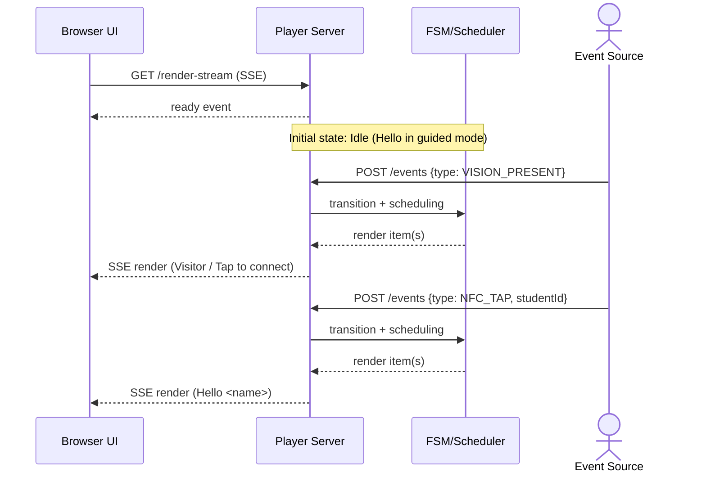

# Event To Render Sequence

```mermaid
sequenceDiagram
  participant Browser as Browser UI
  participant Player as Player Server
  participant FSM as FSM/Scheduler

  Browser->>Player: GET /render-stream (SSE)
  Player-->>Browser: ready event

  Note over Player,FSM: Initial state: Idle (Hello in guided mode)

  actor Sensor as Event Source
  Sensor->>Player: POST /events {type: VISION_PRESENT}
  Player->>FSM: transition + scheduling
  FSM-->>Player: render item(s)
  Player-->>Browser: SSE render (Visitor / Tap to connect)

  Sensor->>Player: POST /events {type: NFC_TAP, studentId}
  Player->>FSM: transition + scheduling
  FSM-->>Player: render item(s)
  Player-->>Browser: SSE render (Hello <name>)
```
