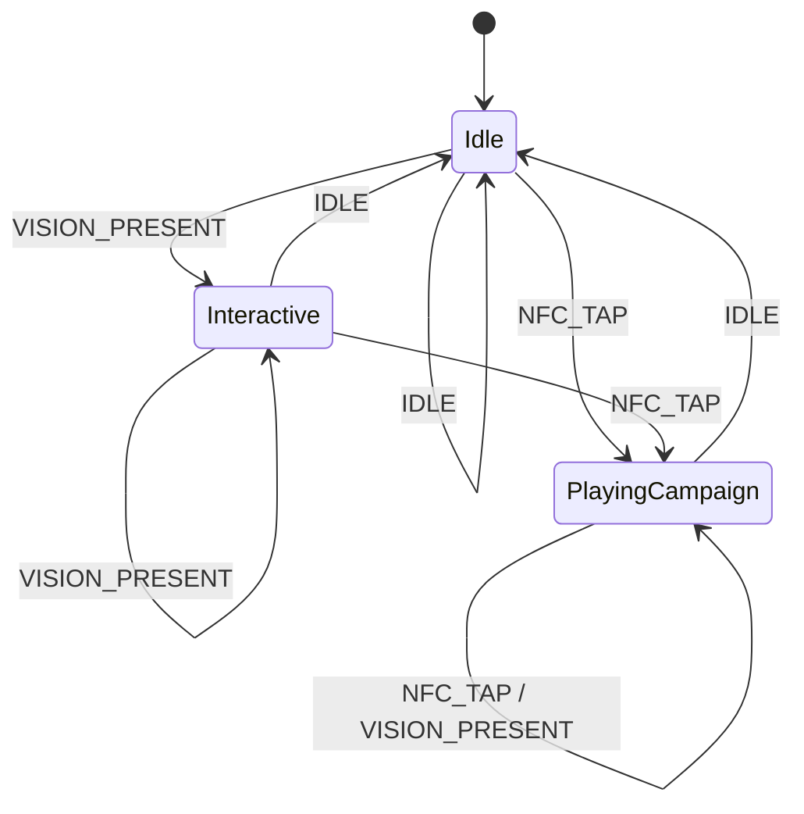

# Runtime States (Player FSM)

```mermaid
stateDiagram-v2
  [*] --> Idle
  Idle --> Interactive: VISION_PRESENT
  Idle --> PlayingCampaign: NFC_TAP
  Interactive --> Interactive: VISION_PRESENT
  Interactive --> PlayingCampaign: NFC_TAP
  PlayingCampaign --> PlayingCampaign: NFC_TAP / VISION_PRESENT
  Idle --> Idle: IDLE
  Interactive --> Idle: IDLE
  PlayingCampaign --> Idle: IDLE
```
