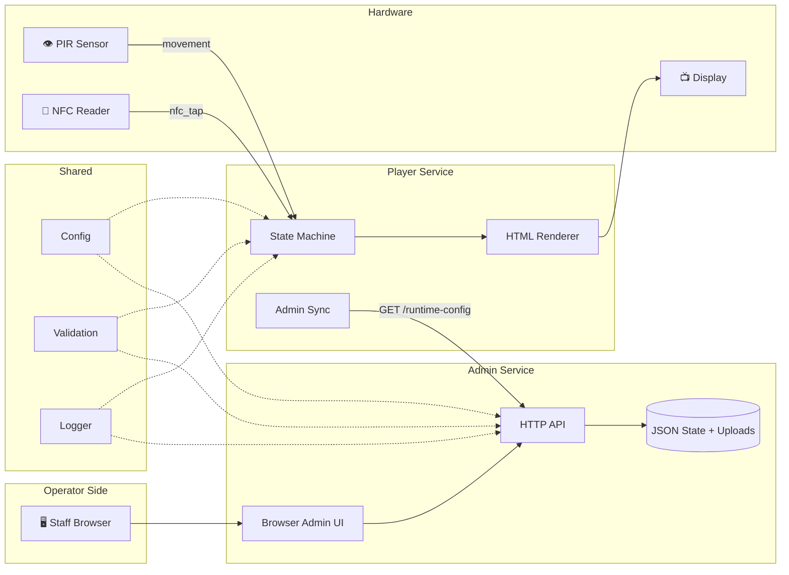
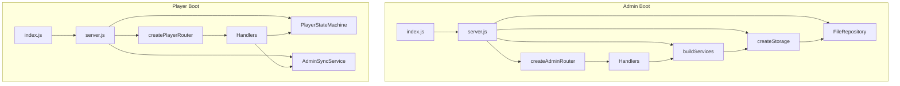
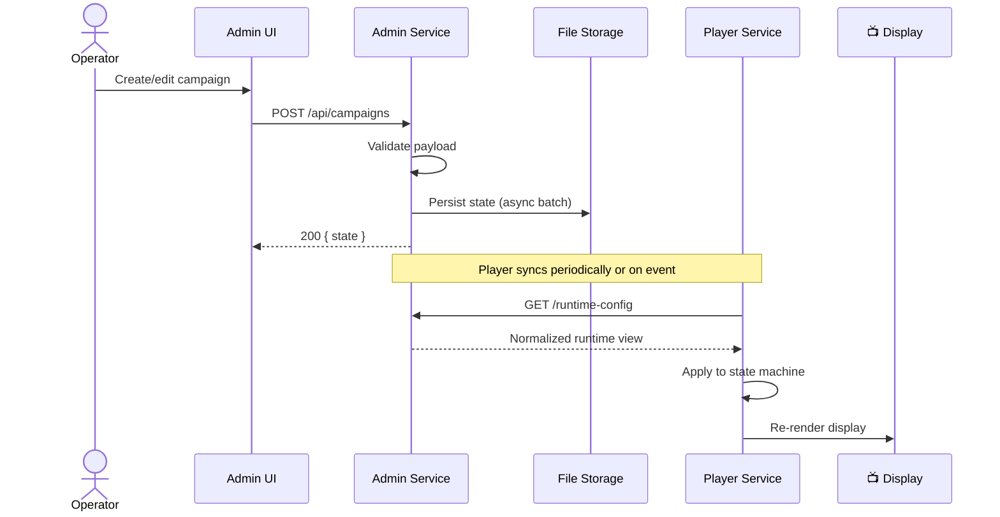
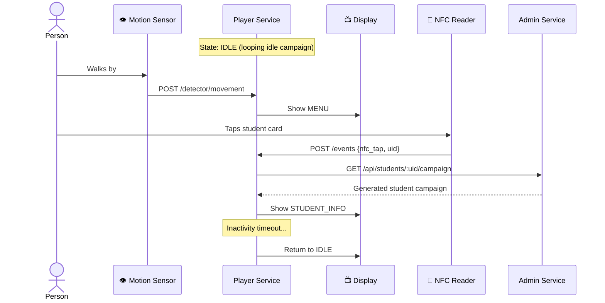
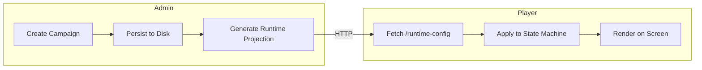

# Architecture Overview

> IDS has two jobs: let staff decide what appears on the sign, and show the right content at the right time.

---

## System Context



---

## Service Responsibilities

```mermaid
flowchart TD
    subgraph Admin["Admin — The Control Plane"]
        direction TB
        A1[Campaign & student configuration]
        A2[Persistent state in JSON file]
        A3[Browser admin UI serving]
        A4[Media upload & serving]
        A5[Runtime config projection for player]
    end

    subgraph Player["Player — The Display Runtime"]
        direction TB
        P1[Startup config loading]
        P2[In-memory state machine]
        P3[Full-screen HTML rendering]
        P4[Event ingestion — motion, NFC, scroll]
        P5[Optional live sync from admin]
    end

    subgraph Shared["Shared — The Common Ground"]
        direction TB
        S1[Environment config parsing]
        S2[Validation & error types]
        S3[HTTP helpers & structured logging]
        S4[JSON Schema contract]
    end
```



---

## Runtime Wiring

How each service boots and assembles its dependencies:



---

## How Data Moves

### Content Publishing Flow



### Display Interaction Flow



---

## Core Architectural Rules

```
┌──────────────────────────────────────────────────────────────┐
│                                                              │
│  Admin:   Router → Handler → Service → Storage → Repository │
│  Player:  Router → Handler → Service / State Machine         │
│  Shared:  Reusable code only — no runtime state ownership    │
│                                                              │
│  Admin persistence:  Async, repository-backed                │
│  Player state:       In-memory only, not persisted           │
│                                                              │
└──────────────────────────────────────────────────────────────┘
```

---

## Campaign Lifecycle



### Campaign Types

| Type | When It Shows | Trigger |
|------|--------------|---------|
| **Idle** | No one is interacting | Default / inactivity timeout |
| **Menu** | Someone is detected | `movement_detected` event |
| **Visitor** | Visitor raises hand to proceed | `visitor_selected` event (hand raise detected) |
| **Student** | Student identified by NFC | `nfc_tap` with known UID |

---

## Documentation Map

| Next Read | What You'll Learn |
|-----------|-------------------|
| [Glossary](../glossary.md) | All IDS terminology explained |
| [Admin Architecture](admin.md) | Admin internals — layers, persistence, UI, media |
| [Player Architecture](player.md) | Player internals — state machine, events, rendering |
| [Shared Architecture](shared.md) | Common code — config, validation, logging, contract |
| [Admin API](../api/admin.md) | Full admin endpoint reference |
| [Player API](../api/player.md) | Full player endpoint reference |
