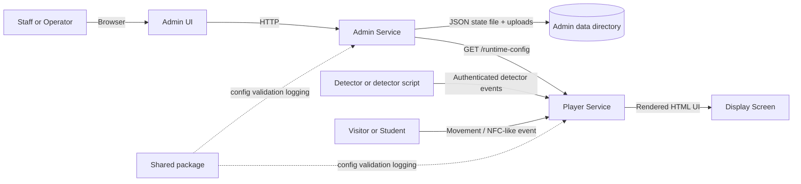
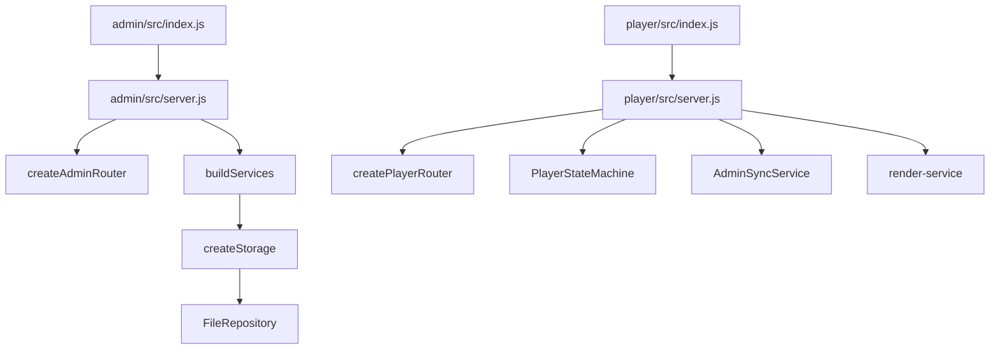
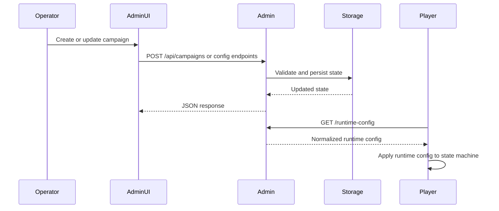

# Architecture Overview

This document explains IDS as a whole before diving into package-level details.

## Plain-Language Summary

IDS has two jobs:

- let staff decide what should appear on the sign
- show the right content on the sign at the right time

The `admin` service handles the first job. The `player` service handles the second. The `shared` package provides the rules and utilities both sides use.

## System Context

## Main Responsibilities

### Admin

- owns campaign and student-related configuration
- stores persistent state in a JSON file through `FileRepository`
- serves the browser admin UI and uploaded media
- exposes `/runtime-config` so the player can fetch a normalized runtime view

### Player

- loads a startup config from disk
- keeps an in-memory state machine for the current screen state
- renders the display UI as HTML
- accepts user and detector events
- optionally refreshes runtime config and student campaigns from admin

### Shared

- validates environment configuration
- provides error and validation helpers
- provides JSON response helpers and logger utilities
- ships the JSON schema and example config used by the player contract

## Runtime Wiring

## How Data Moves

## Core Architectural Rules

- Admin follows `router -> handler -> service -> storage`.
- Player follows `router -> handler -> state/service`.
- `shared/` contains reusable code only; it does not own runtime state.
- Admin persistence is behind an async repository interface.
- Player runtime state is in memory; it is not persisted by the player itself.

## Important User Flows

### Content Management Flow

1. An operator edits campaigns or student data in the admin UI.
2. Admin handlers parse the request and delegate to services.
3. Services call the storage facade.
4. The storage facade validates input, updates state, and writes through the repository.
5. The player later consumes the normalized runtime projection.

### Display Interaction Flow

1. The player starts in `IDLE`.
2. Movement moves the player to `MENU`.
3. A visitor selection opens the visitor campaign.
4. An NFC-style event attempts to resolve a student and show student info.
5. Inactivity returns the player to `IDLE`.

## Documentation Map

- Beginner terms: [`../glossary.md`](/home/fergyah/School/S8/PROJ/Project/ids/docs/glossary.md)
- Admin internals: [`admin.md`](/home/fergyah/School/S8/PROJ/Project/ids/docs/architecture/admin.md)
- Player internals: [`player.md`](/home/fergyah/School/S8/PROJ/Project/ids/docs/architecture/player.md)
- Shared internals: [`shared.md`](/home/fergyah/School/S8/PROJ/Project/ids/docs/architecture/shared.md)
- Admin API: [`../api/admin.md`](/home/fergyah/School/S8/PROJ/Project/ids/docs/api/admin.md)
- Player API: [`../api/player.md`](/home/fergyah/School/S8/PROJ/Project/ids/docs/api/player.md)
