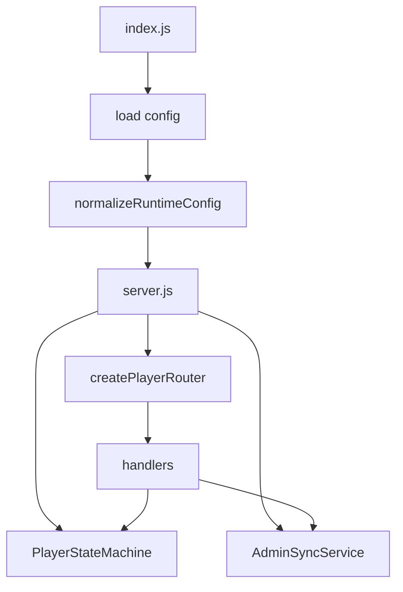
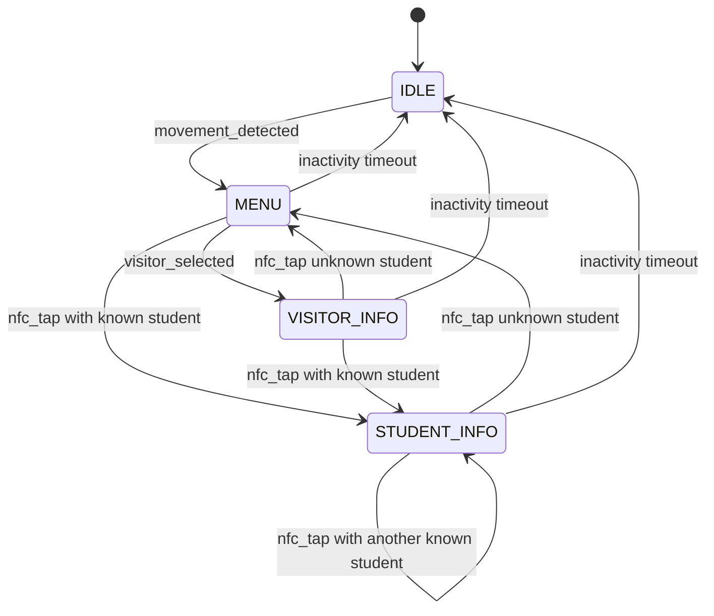
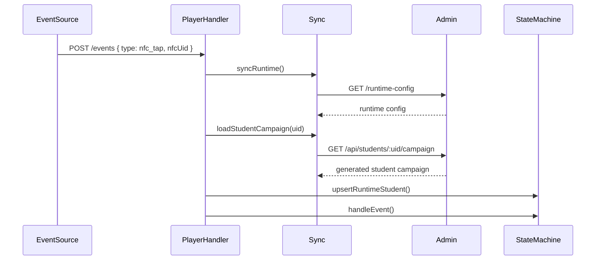

# Player Architecture

This document explains how the player service starts, how it renders content, and how events drive the display.

## Purpose

The player service is the runtime that appears on the display. It owns:

- startup config loading
- runtime config normalization
- the in-memory state machine
- event ingestion
- detector-authenticated endpoints
- HTML rendering for the display UI
- optional synchronization with the admin service

## Composition Root

Startup begins in [`player/src/index.js`](/home/fergyah/School/S8/PROJ/Project/ids/player/src/index.js):

1. parse CLI arguments and environment-based defaults
2. load the runtime config JSON file
3. optionally load detector config JSON
4. validate the runtime config with `normalizeRuntimeConfig`
5. call [`player/src/server.js`](/home/fergyah/School/S8/PROJ/Project/ids/player/src/server.js)

`server.js` then creates:

- `PlayerStateMachine`
- a random detector token
- normalized detector config
- `AdminSyncService`
- the player router

## Runtime State Machine

The core logic lives in [`player/src/services/state-machine.js`](/home/fergyah/School/S8/PROJ/Project/ids/player/src/services/state-machine.js).

The main states are:

- `IDLE`
- `MENU`
- `VISITOR_INFO`
- `STUDENT_INFO`

### Transition Rules

### What The State Machine Tracks

- current state
- current campaign
- current item index
- current student UID
- inactivity timeout
- normalized runtime config

`getStatus()` is the main state snapshot used by `/current`, `/health`, `/runtime-config` application responses, and the renderer.

## Event Sources

### Regular Event Endpoint

`POST /events` accepts UI/manual events. It rejects movement events from this route so motion input must come through the detector-authenticated endpoints.

### Detector Endpoints

- `POST /detector/movement`
- `POST /detector/events`

These require the `x-detector-token` header to match the random token generated at boot.

### Admin-Sync-Assisted NFC Flow

When admin sync is configured and the player receives an NFC-like event in `MENU`, `VISITOR_INFO`, or `STUDENT_INFO`:

1. the player refreshes runtime config from admin
2. it requests `/api/students/:uid/campaign`
3. if admin returns a generated campaign, the player injects that student into the runtime state
4. the state machine then transitions to `STUDENT_INFO`

## Rendering Model

[`player/src/services/render-service.js`](/home/fergyah/School/S8/PROJ/Project/ids/player/src/services/render-service.js) returns a full HTML page.

It renders:

- page shell and CSS
- current state labels
- campaign item content
- menu UI
- debug controls
- detector client script

The renderer uses the current state-machine status plus detector config values.

## Runtime Config Model

The player accepts two config shapes:

- the current runtime config shape with `idleCampaign`, `menuCampaign`, and `visitorCampaign`
- a legacy `campaigns` array shape that is normalized for compatibility

Detector config is normalized separately and bounded by defaults from `config-service.js`.

## Failure Modes To Understand

- invalid startup config exits the process during boot
- invalid detector config JSON exits the process during boot
- invalid runtime-config POST payload returns `400 { error: "invalid_runtime_config" }`
- wrong detector token returns `403 { error: "forbidden_detector_source" }`
- unsupported detector event type returns `400 { error: "invalid_detector_event_type" }`
- movement events posted to `/events` return `403`

## Related Docs

- Player API details: [`../api/player.md`](/home/fergyah/School/S8/PROJ/Project/ids/docs/api/player.md)
- Shared config and helpers: [`shared.md`](/home/fergyah/School/S8/PROJ/Project/ids/docs/architecture/shared.md)
- System view: [`overview.md`](/home/fergyah/School/S8/PROJ/Project/ids/docs/architecture/overview.md)
