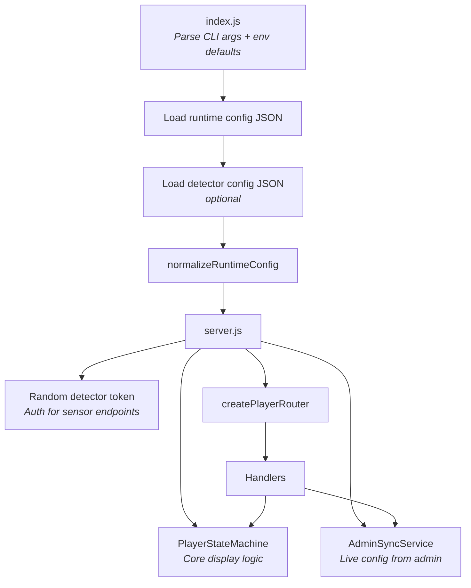
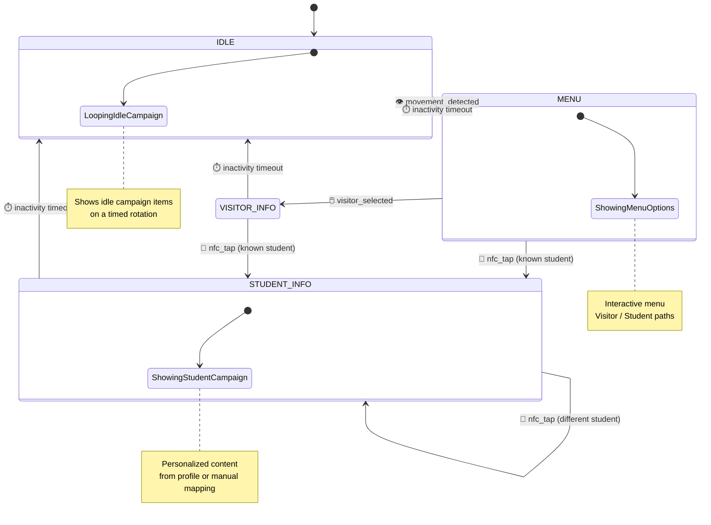
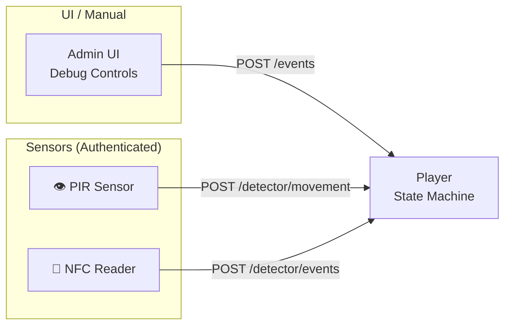
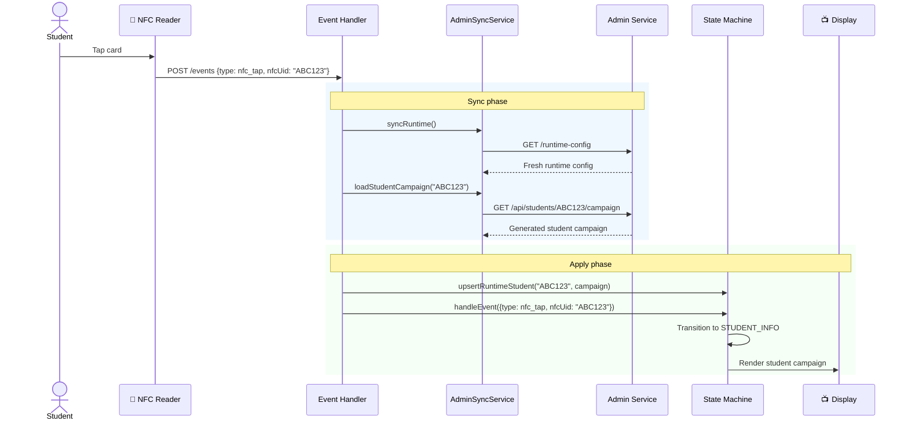

# Player Architecture

> The display runtime — it renders content and reacts to the world around it.

---

## What Player Owns

```
┌─────────────────────────────────────────┐
│             Player Service              │
├─────────────────────────────────────────┤
│  Startup config loading                 │
│  Runtime config normalization           │
│  In-memory state machine                │
│  Event ingestion (motion, NFC, scroll)  │
│  Detector-authenticated endpoints       │
│  Full-screen HTML rendering             │
│  Optional live sync with admin          │
└─────────────────────────────────────────┘
```

---

## Composition Root



---

## The State Machine

The heart of the player. It tracks what's on screen and how events change it.



### What The State Machine Tracks

| Field | Purpose |
|-------|---------|
| `state` | Current screen state (IDLE, MENU, VISITOR_INFO, STUDENT_INFO) |
| `campaignId` | Active campaign being displayed |
| `campaignName` | Human-readable campaign label |
| `itemIndex` | Current item in the campaign rotation |
| `currentStudentUid` | NFC UID of the identified student (if any) |
| `inactivityTimeoutMs` | How long before returning to IDLE |
| `runtimeUpdatedAt` | Timestamp of last config update |

---

## Event Sources

Three ways events reach the player:



| Source | Endpoint | Auth Required | Events |
|--------|----------|---------------|--------|
| UI / Manual | `POST /events` | No | All except `movement_detected` |
| Motion sensor | `POST /detector/movement` | `x-detector-token` | Always `movement_detected` |
| NFC / Detector | `POST /detector/events` | `x-detector-token` | Filtered by allowed types |

### Event Normalization

The state machine normalizes aliases automatically:

```
movement, vision_present  →  movement_detected
visitor_detected          →  visitor_selected
nfc                       →  nfc_tap
right_hand_move           →  scroll_next
left_hand_move            →  scroll_prev
```

---

## NFC Student Flow

The most complex interaction — identifying a student and showing personalized content:



---

## Rendering Model

The render service generates a complete HTML page for every state:

```mermaid
flowchart TD
    SM[State Machine<br/>getStatus()] --> RS[Render Service]
    DC[Detector Config] --> RS

    RS --> HTML[Full HTML Page]

    HTML --> Shell[Page Shell + CSS]
    HTML --> State[State Labels]
    HTML --> Content[Campaign Item Content]
    HTML --> Menu[Menu UI<br/><i>when in MENU state</i>]
    HTML --> Debug[Debug Controls<br/><i>when debug=1</i>]
    HTML --> Detector[Detector Client Script]
```

The renderer outputs a **self-contained HTML page** — no client-side SPA, no build step. The browser just loads the page and it works.

---

## Runtime Config

The player accepts two config shapes at startup:

| Shape | Structure | When |
|-------|-----------|------|
| **Current** | `{ idleCampaign, menuCampaign, visitorCampaign }` | Standard format |
| **Legacy** | `{ campaigns: [...] }` | Normalized automatically for compatibility |

Detector config is normalized separately with defaults from `config-service.js`.

---

## Error Handling

| Scenario | Behavior |
|----------|----------|
| Invalid startup config | Process exits during boot |
| Invalid detector config JSON | Process exits during boot |
| Invalid runtime-config POST | `400 { error: "invalid_runtime_config" }` |
| Wrong/missing detector token | `403 { error: "forbidden_detector_source" }` |
| Unsupported detector event type | `400 { error: "invalid_detector_event_type" }` |
| Movement via `/events` | `403 { error: "movement_event_requires_detector" }` |

---

## Related Docs

| Document | Description |
|----------|-------------|
| [Player API Reference](../api/player.md) | Every endpoint in detail |
| [Shared Architecture](shared.md) | Config, validation, helpers used by player |
| [Architecture Overview](overview.md) | The full system view |
