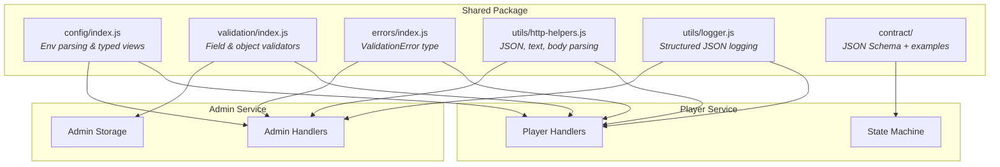
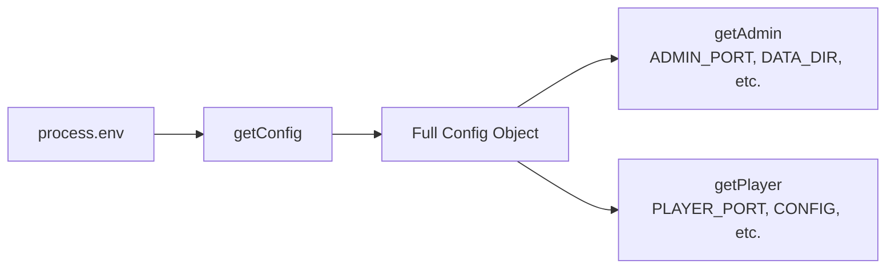
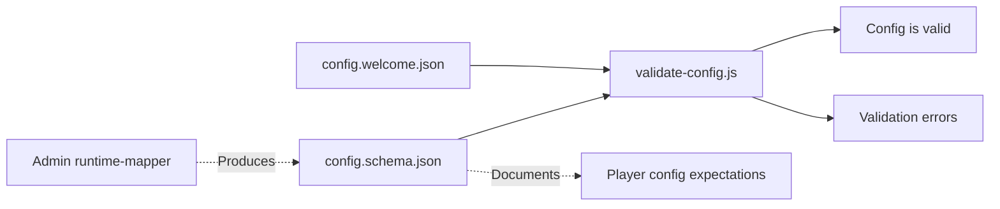

# Shared Architecture

> The common ground — one package to keep both services speaking the same language.

---

## Why Shared Exists

Without `shared/`, the two services would drift on:

```
┌──────────────────────────────────────────────────────────┐
│                                                          │
│  Config names & defaults    →  Different env parsing     │
│  Validation behavior        →  Inconsistent rules        │
│  Error structure            →  Incompatible error shapes  │
│  Logging format             →  Unreadable mixed logs     │
│  Runtime config contract    →  Admin/Player mismatch     │
│                                                          │
└──────────────────────────────────────────────────────────┘
```

One package, one set of rules, two services that stay compatible.

---

## Dependency Map



---

## Module Reference

### Config — `shared/config/index.js`

Parses environment variables and exposes typed views:



| Variable | Type | Default | Used By |
|----------|------|---------|---------|
| `NODE_ENV` | string | `development` | Both |
| `ADMIN_PORT` | number | `8081` | Admin |
| `PLAYER_PORT` | number | `7070` | Player |
| `ADMIN_HOST` | string | `127.0.0.1` | Admin |
| `PLAYER_HOST` | string | `127.0.0.1` | Player |
| `IDS_CONFIG` | path | — | Player |
| `IDS_ADMIN_URL` | URL | — | Player |
| `IDS_PUBLIC_ADMIN_URL` | URL | — | Admin |
| `IDS_ADMIN_DATA_DIR` | path | `admin/data` | Admin |
| `IDS_DETECTOR_CONFIG` | JSON string | — | Player |
| `LOG_LEVEL` | string | `info` | Both |

---

### Validation — `shared/validation/index.js`

Field-level and object-level helpers for lightweight validation where a full JSON Schema is overkill:

```
validateRequired(value, fieldName)   →  issue or null
validateString(value, fieldName)     →  issue or null
validateInteger(value, fieldName)    →  issue or null
validateEnum(value, allowed, field)  →  issue or null
...
```

Used by admin storage validators to check campaign items, student data, and settings.

---

### Errors — `shared/errors/index.js`

Defines `ValidationError` — the shared error type thrown when input fails validation:

```
ValidationError {
  message: string
  issues: string[]
}
```

Handlers catch this and map it to `400 { error: "validation_failed", issues: [...] }`.

---

### HTTP Helpers — `shared/utils/http-helpers.js`

The base request/response layer for both services:

| Helper | Purpose |
|--------|---------|
| `json(res, data, status)` | Send JSON response |
| `text(res, body, status)` | Send plain text response |
| `readJsonBody(req)` | Parse request body as JSON |
| `escapeHtml(str)` | Prevent XSS in rendered HTML |

---

### Logger — `shared/utils/logger.js`

Structured JSON log lines for machine-parseable output:

```json
{
  "timestamp": "2026-03-13T10:30:00.000Z",
  "level": "info",
  "service": "admin",
  "message": "Server listening on 127.0.0.1:8081",
  "meta": {}
}
```

Levels: `debug` | `info` | `warn` | `error`

---

### Contract — `shared/contract/`

The formal agreement between admin and player on config shape:

```
shared/contract/
├── schema/
│   └── config.schema.json      JSON Schema definition
├── examples/
│   └── config.welcome.json     Bundled example config
└── scripts/
    └── validate-config.js      Validation script (used by `make validate`)
```



---

## Package Structure

```
shared/
├── config/
│   └── index.js            Environment parsing + typed views
├── validation/
│   └── index.js            Field-level validators
├── errors/
│   └── index.js            ValidationError type
├── utils/
│   ├── http-helpers.js     JSON/text response, body parsing, HTML escape
│   └── logger.js           Structured JSON logging
├── contract/
│   ├── schema/             JSON Schema for runtime config
│   ├── examples/           Bundled example configs
│   └── scripts/            Validation tooling
├── test/
│   ├── config.test.js      Config parsing tests
│   ├── errors.test.js      Error behavior tests
│   └── validation.test.js  Validator tests
└── package.json            Dependencies: ajv, ajv-formats
```

---

## Related Docs

| Document | Description |
|----------|-------------|
| [Architecture Overview](overview.md) | How shared fits in the system |
| [Admin Architecture](admin.md) | How admin uses shared code |
| [Player Architecture](player.md) | How player uses shared code |
| [Testing Guide](../testing.md) | Shared test suite details |
