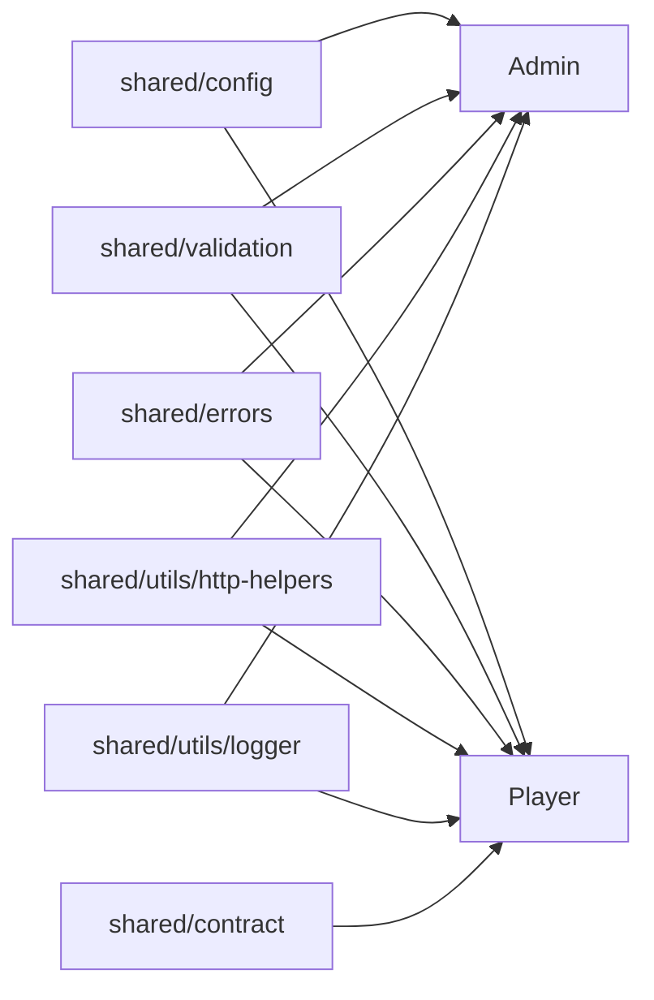

# Shared Architecture

The `shared/` package contains the code that both `admin` and `player` rely on for common behavior.

## Responsibilities

- parse and validate environment variables
- provide reusable validation helpers
- provide error types
- provide JSON and text HTTP helpers
- provide structured logging
- define the JSON schema and example runtime config contract

## Main Modules

### Config

[`shared/config/index.js`](/home/fergyah/School/S8/PROJ/Project/ids/shared/config/index.js) defines the environment schema and exposes:

- `Config`
- `getConfig()`
- typed views through `getAdmin()` and `getPlayer()`

Supported environment variables:

- `NODE_ENV`
- `ADMIN_PORT`
- `PLAYER_PORT`
- `IDS_CONFIG`
- `IDS_ADMIN_URL`
- `IDS_ADMIN_DATA_DIR`
- `IDS_PUBLIC_ADMIN_URL`
- `IDS_DETECTOR_CONFIG`
- `LOG_LEVEL`

### Validation

[`shared/validation/index.js`](/home/fergyah/School/S8/PROJ/Project/ids/shared/validation/index.js) contains field-level and object-level validation helpers used where a small reusable schema is sufficient.

### Errors

[`shared/errors/index.js`](/home/fergyah/School/S8/PROJ/Project/ids/shared/errors/index.js) defines the shared `ValidationError` type used across the workspace.

### HTTP Helpers

[`shared/utils/http-helpers.js`](/home/fergyah/School/S8/PROJ/Project/ids/shared/utils/http-helpers.js) provides:

- `json()`
- `text()`
- `readJsonBody()`
- `escapeHtml()`

These utilities are the base response and request parsing layer for both services.

### Logger

[`shared/utils/logger.js`](/home/fergyah/School/S8/PROJ/Project/ids/shared/utils/logger.js) emits structured JSON log lines with:

- timestamp
- level
- service name
- message
- optional metadata object

## Contract Assets

The player runtime config contract lives under `shared/contract/`.

Important files:

- [`shared/contract/schema/config.schema.json`](/home/fergyah/School/S8/PROJ/Project/ids/shared/contract/schema/config.schema.json)
- [`shared/contract/examples/config.welcome.json`](/home/fergyah/School/S8/PROJ/Project/ids/shared/contract/examples/config.welcome.json)
- [`shared/contract/scripts/validate-config.js`](/home/fergyah/School/S8/PROJ/Project/ids/shared/contract/scripts/validate-config.js)

## How Shared Code Constrains The Services

## Why This Package Matters

Without `shared/`, the two services would drift on:

- config names and defaults
- validation behavior
- error structure
- logging format
- runtime config contract expectations

Keeping those rules in one place is what lets the two services stay compatible while evolving independently.
