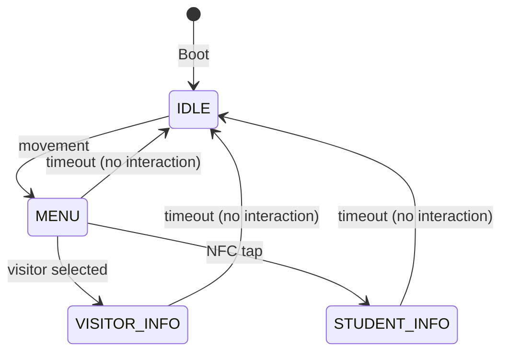
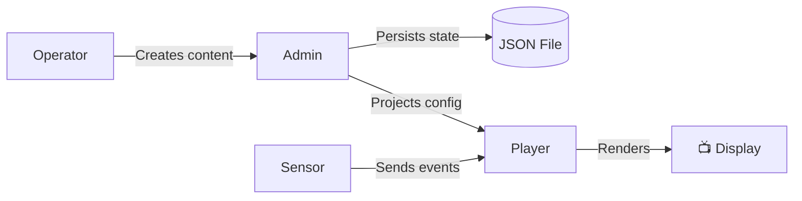

# Glossary

> Every term you'll encounter in the IDS project, explained plainly.

---

## System Components

| Term | Definition |
|------|-----------|
| **Admin Service** | The control plane. Stores data, serves the browser UI, exposes management APIs, and publishes runtime config for the player. |
| **Player Service** | The display runtime. Renders signage content, accepts events, and changes what is shown on screen. |
| **Shared Package** | Common code used by both services — config, validation, errors, logging, and the runtime config contract. |

---

## Content Model

| Term | Definition |
|------|-----------|
| **Campaign** | A named collection of content items shown by the player. Each campaign has an ID, name, priority, and ordered items. |
| **Campaign Item** | One piece of content inside a campaign — includes `contentId`, `type` (TEXT/IMAGE/VIDEO), `data`, `order`, and `durationSec`. |
| **Idle Campaign** | Content shown when nobody is interacting with the display. Loops automatically. |
| **Menu Campaign** | The interactive choice screen shown after movement is detected — lets users pick visitor or student paths. |
| **Visitor Campaign** | Content shown when the generic visitor path is selected from the menu. |
| **Student Campaign** | Personalized content shown when a student is identified by NFC. Can be manually created or auto-generated from a profile. |
| **Generated Student Campaign** | A campaign created automatically from `studentProfiles` data — not entered item by item. Returned by `/api/students/:uid/campaign`. |
| **Active Campaign** | The currently selected idle or visitor campaign. Admin can store multiple of each kind, but only one per type is active at a time. |

---

## Player Concepts

| Term | Definition |
|------|-----------|
| **State Machine** | The player component tracking which screen state is active and how events cause transitions between states. |
| **Runtime Config** | The normalized data structure the player uses at runtime — includes active campaigns, settings, and student entries. Produced by admin's runtime mapper. |
| **Detector Event** | An event from the detector-authenticated endpoints. Requires the boot-time detector token in the `x-detector-token` header. |
| **NFC-Like Event** | An event such as `nfc_tap` that identifies a student by UID, potentially triggering the student info flow. |
| **NFC Error Feedback** | When an unrecognized NFC card is tapped, the state machine sets `lastNfcError` and the player shows a "Card not recognized" banner on the menu screen. Clears automatically on the next successful event. |
| **Timeout Warning** | A countdown toast shown when inactivity timeout is less than 5 seconds away (e.g., "Returning to home in 3s..."). Driven by the `timeoutEndsAt` field in the state machine status, polled by the client every 1 second. |
| **Presence Keepalive** | An automatic event (`presence_keepalive`) sent by the browser detector every 3 seconds while someone is in front of the camera in a non-IDLE state. Acknowledged by the state machine but does **not** reset the inactivity timer — only real interactions (gestures, taps) reset it. |
| **NFC Keepalive** | When the same NFC card is tapped again while already viewing that student's STUDENT_INFO, the state machine treats it as a keepalive — the carousel position is preserved but the inactivity timer is **not** reset. |

---

## Architecture Terms

| Term | Definition |
|------|-----------|
| **Router** | URL + method dispatch layer. Does not validate data or mutate state. |
| **Auth Middleware** | Checks the `Authorization: Bearer <key>` header on mutation endpoints. Returns `401` if missing or invalid. Configured via `IDS_ADMIN_API_KEY`. |
| **Handler** | HTTP concern layer — parses bodies, calls services, maps results to status codes. |
| **Service** | Domain logic layer — thin APIs that keep handlers from talking directly to storage. |
| **Storage Facade** | The admin domain layer that validates data, coordinates state changes, and delegates persistence to the repository. |
| **Repository** | The persistence boundary. `FileRepository` reads/writes a JSON state file with async batch writes. |
| **StudentDb** | SQLite-backed persistence for student profiles, using `better-sqlite3`. Separate from the JSON state file. |
| **Runtime Mapper** | Transforms the full admin state into the normalized runtime config consumed by the player. |

---

## Data Flow

---

## Related Docs

| Document | What You'll Learn |
|----------|-------------------|
| [Architecture Overview](architecture/overview.md) | How all these pieces fit together |
| [Admin Architecture](architecture/admin.md) | Deep dive into admin layers |
| [Player Architecture](architecture/player.md) | Deep dive into the state machine |
