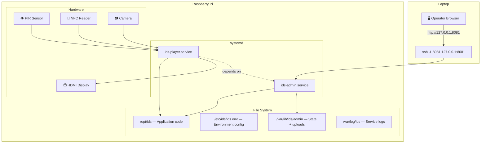
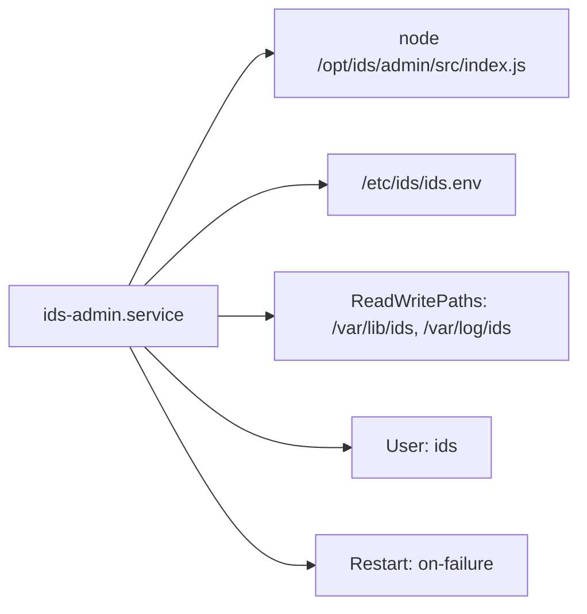
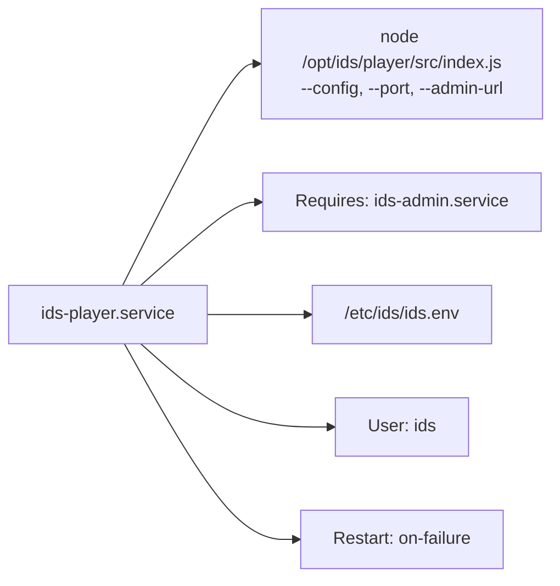

# Raspberry Pi Deployment

> Running IDS on real hardware — from flashing the Pi to daily use.

---

## Deployment Architecture



---

## Operating Model

The deployment goal is:

- the Raspberry Pi runs both services all the time
- the Pi drives the external display locally
- the laptop is only used as a remote operator device for creating and publishing content

That means the Pi becomes the permanent host for:

- admin state
- uploaded media
- runtime config projection
- the player screen shown on the attached display

The laptop does not run IDS itself in the normal deployment. Instead, it reaches the Pi-hosted admin UI through SSH port forwarding:

```bash
ssh -L 8081:127.0.0.1:8081 <pi-user>@<pi-host>
```

Then the operator opens:

```text
http://127.0.0.1:8081
```

This matches the behavior:

- same content editing and publishing flow as on the laptop
- same admin and player logic as the current app
- better security than exposing the admin UI directly on the network

Why this matters: the current admin service has no built-in operator login, so binding it to localhost on the Pi and accessing it through SSH is the safest mode supported by the current codebase.

---

## File Layout

| Path | Purpose | Owner |
|------|---------|-------|
| `/opt/ids` | Application code (git repo) | `ids:ids` |
| `/etc/ids/ids.env` | Environment configuration | `root:root` |
| `/var/lib/ids/admin` | Persistent admin state + uploaded media | `ids:ids` |
| `/var/log/ids` | Service log output | `ids:ids` |

---

## Step-by-Step Setup

### 1. Flash the Pi

Use Raspberry Pi Imager and prepare the card with:

- Raspberry Pi OS Bookworm
- a hostname such as `ids-pi`
- SSH enabled
- a non-default username
- Wi-Fi configured only if Ethernet is not available

Recommended choices:

- use Ethernet if possible
- connect the Pi to the external display before first full boot
- keep the Pi on a trusted private network

### 2. First boot

Log into the Pi and update it:

```bash
sudo apt update
sudo apt full-upgrade -y
sudo timedatectl set-timezone Europe/Paris
sudo raspi-config
```

Inside `raspi-config`, verify:

- the hostname
- SSH
- camera support if your detector setup will use it
- display and boot behavior appropriate for your screen setup

### 3. Set up SSH access from the laptop

On the Pi, make sure SSH is enabled and running:

```bash
sudo systemctl enable --now ssh
sudo systemctl status ssh
```

On the laptop, check whether you already have an SSH key:

```bash
ls -la ~/.ssh
```

If you do not have `~/.ssh/id_ed25519` and `~/.ssh/id_ed25519.pub`, create them:

```bash
ssh-keygen -t ed25519 -f ~/.ssh/id_ed25519 -C "<your-name>@<laptop>"
```

Find the Pi username on the Pi:

```bash
whoami
hostname -I
```

Use the Pi IP address from `hostname -I` on the laptop for the first connection:

```bash
ssh <pi-user>@<pi-ip>
```

If the connection works with a password, copy your laptop public key to the Pi:

```bash
ssh-copy-id -i ~/.ssh/id_ed25519.pub <pi-user>@<pi-ip>
```

If `ssh-copy-id` is unavailable or fails, copy the key manually. On the laptop:

```bash
cat ~/.ssh/id_ed25519.pub
```

Then on the Pi:

```bash
mkdir -p ~/.ssh
chmod 700 ~/.ssh
nano ~/.ssh/authorized_keys
chmod 600 ~/.ssh/authorized_keys
```

Paste the key into `~/.ssh/authorized_keys`, save, and exit.

Verify passwordless login from the laptop:

```bash
ssh <pi-user>@<pi-ip>
```

If key login works, test the SSH tunnel that will be used for the admin UI:

```bash
ssh -L 8081:127.0.0.1:8081 <pi-user>@<pi-ip>
```

Then open:

```text
http://127.0.0.1:8081
```

Optional hardening after key login works:

- disable password SSH login
- disable root SSH login

### 4. Install runtime prerequisites

```bash
sudo apt install -y git curl ca-certificates
```

Install Node.js 20 and npm from NodeSource:

```bash
curl -fsSL https://deb.nodesource.com/setup_20.x | sudo -E bash -sudo apt install -y nodejs
```

Verify the installed versions:

```bash
node -v
npm -v
```

Expected result:

- `node -v` should report `v20.x.x` or newer
- `npm -v` should print an npm version number

If `node -v` is below 20, do not continue until Node.js has been upgraded.

If the Pi will open the player in a local browser window, also install Chromium:

```bash
sudo apt install -y chromium-browser
```

### 5. Create the IDS runtime user

```bash
sudo useradd --system --home /opt/ids --shell /usr/sbin/nologin ids || true
```

### 6. Create directories

```bash
sudo mkdir -p /opt/ids /etc/ids /var/lib/ids/admin /var/log/ids
sudo chown -R ids:ids /opt/ids /var/lib/ids /var/log/ids
sudo chmod 750 /etc/ids /var/lib/ids /var/log/ids
```

### 7. Put the repository at `/opt/ids`

Clone or copy the IDS repository to `/opt/ids`.

### 8. Install the environment file

```bash
sudo cp /opt/ids/deploy/pi/env/ids.env /etc/ids/ids.env
sudo chown root:root /etc/ids/ids.env
sudo chmod 640 /etc/ids/ids.env
```

### 9. Install dependencies

```bash
cd /opt/ids
npm --prefix admin install
npm --prefix player install
npm --prefix shared/contract install
```

### 10. Install systemd units

```bash
sudo cp /opt/ids/deploy/pi/systemd/ids-admin.service /etc/systemd/system/
sudo cp /opt/ids/deploy/pi/systemd/ids-player.service /etc/systemd/system/
sudo systemctl daemon-reload
sudo systemctl enable ids-admin.service ids-player.service
```

### 11. Start services

```bash
sudo systemctl start ids-admin.service
sudo systemctl start ids-player.service
```

---

## Environment Configuration

Edit `/etc/ids/ids.env` before starting regular use:

| Variable | Value | Why It Matters |
|----------|-------|----------------|
| `ADMIN_HOST` | `127.0.0.1` | Keep admin private to the Pi |
| `PLAYER_HOST` | `127.0.0.1` | Keep player local to the Pi display |
| `ADMIN_PORT` | `8081` | Admin service port |
| `PLAYER_PORT` | `7070` | Player service port |
| `IDS_ADMIN_URL` | `http://127.0.0.1:8081` | How the player reaches admin |
| `IDS_PUBLIC_ADMIN_URL` | `http://127.0.0.1:8081` | Base URL used for generated media links |
| `IDS_ADMIN_DATA_DIR` | `/var/lib/ids/admin` | State and uploads location |
| `IDS_CONFIG` | Path to startup config | Player startup configuration |
| `IDS_DETECTOR_CONFIG` | JSON string (optional) | Motion detection tuning |

Important behavior:

- uploaded media URLs are generated from `IDS_PUBLIC_ADMIN_URL`
- the player fetches those URLs when rendering media blocks
- when the player runs on the Pi itself, `http://127.0.0.1:8081` is the correct secure value

If `IDS_PUBLIC_ADMIN_URL` points at the wrong host, media URLs in campaigns will break.

---

## Daily Use

### On the Pi

The Pi runs:

- `ids-admin.service`
- `ids-player.service`
- the attached display showing the player UI

For the local display, open:

```text
http://127.0.0.1:7070
```

For manual verification on the Pi desktop:

```bash
chromium-browser --app=http://127.0.0.1:7070
```

### On the laptop

Open the SSH tunnel:

```bash
ssh -L 8081:127.0.0.1:8081 <pi-user>@<pi-host>
```

Then open the admin UI in the laptop browser:

```text
http://127.0.0.1:8081
```

This lets you:

- create campaigns
- upload media
- publish changes
- manage the Pi-hosted system without exposing admin directly on the LAN

---

## systemd Units

### ids-admin.service



### ids-player.service



The player depends on admin — systemd ensures admin starts first.

---

## Smoke Check

Verify both services are healthy:

```bash
cd /opt/ids
./deploy/pi/smoke-check.sh
```

Override the per-request timeout:

```bash
SMOKE_TIMEOUT=10 ./deploy/pi/smoke-check.sh
```

**What it checks:**

| Service | Endpoint | Verifies |
|---------|----------|----------|
| Admin | `/health` | Service is running |
| Admin | `/api/state` | State is readable |
| Admin | `/runtime-config` | Runtime projection works |
| Admin | `/services/runtime-deps.js` | UI assets are served |
| Player | `/health` | Service is running |
| Player | `/current` | State machine is responding |

---

## Common Operations

### Update to latest code

```bash
cd /opt/ids
git pull origin main
npm --prefix admin install
npm --prefix player install
npm --prefix shared/contract install
sudo systemctl restart ids-admin.service ids-player.service
./deploy/pi/smoke-check.sh
```

### Update env or unit files

```bash
sudo cp /opt/ids/deploy/pi/env/ids.env /etc/ids/ids.env
sudo cp /opt/ids/deploy/pi/systemd/*.service /etc/systemd/system/
sudo systemctl daemon-reload
sudo systemctl restart ids-admin.service ids-player.service
```

### Verify local-only bind

```bash
ss -ltnp | grep ':8081'   # Should show 127.0.0.1:8081
ss -ltnp | grep ':7070'   # Should show 127.0.0.1:7070
```

### Rollback

```bash
cd /opt/ids
git checkout <previous-known-good-ref>
sudo systemctl restart ids-admin.service ids-player.service
./deploy/pi/smoke-check.sh
```

If you suspect bad state, back it up first:

```bash
sudo cp -a /var/lib/ids/admin /var/lib/ids/admin.backup.$(date +%Y%m%d%H%M%S)
```

---

## Less Secure Alternative

If you want direct browser access from another machine without SSH port forwarding, you can expose admin on the LAN:

```bash
ADMIN_HOST=0.0.0.0
PLAYER_HOST=0.0.0.0
IDS_PUBLIC_ADMIN_URL=http://<pi-hostname-or-ip>:8081
```

That mode is closer to the original remote-browser pattern, but it is less secure because the admin UI is reachable from the network and the current codebase does not provide operator authentication.

---

## Troubleshooting

### Check service status

```bash
sudo systemctl status ids-admin.service
sudo systemctl status ids-player.service
```

### Read logs

```bash
journalctl -u ids-admin.service -n 100 --no-pager
journalctl -u ids-player.service -n 100 --no-pager
```

### Check restart counts

```bash
systemctl show ids-admin.service -p NRestarts
systemctl show ids-player.service -p NRestarts
```

### Reset after restart limit hit

```bash
sudo systemctl reset-failed ids-admin.service
sudo systemctl reset-failed ids-player.service
sudo systemctl restart ids-admin.service ids-player.service
```

### Common issues

| Symptom | Cause | Fix |
|---------|-------|-----|
| Laptop cannot open admin | SSH tunnel not running | Run `ssh -L 8081:127.0.0.1:8081 ...` |
| Media URLs broken | Wrong `IDS_PUBLIC_ADMIN_URL` | Set it to the actual URL the player can reach |
| Player won't start | Admin not ready yet | Check `ids-admin.service` status first |
| Permission denied on data dir | Wrong ownership | `sudo chown -R ids:ids /var/lib/ids` |

---

## Related Docs

| Document | Description |
|----------|-------------|
| [Architecture Overview](../architecture/overview.md) | System design |
| [Status & Roadmap](../status.md) | Deployment hardening plans |
| [Testing Guide](../testing.md) | Verification commands |
