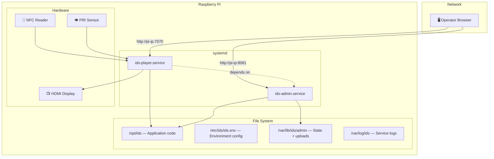
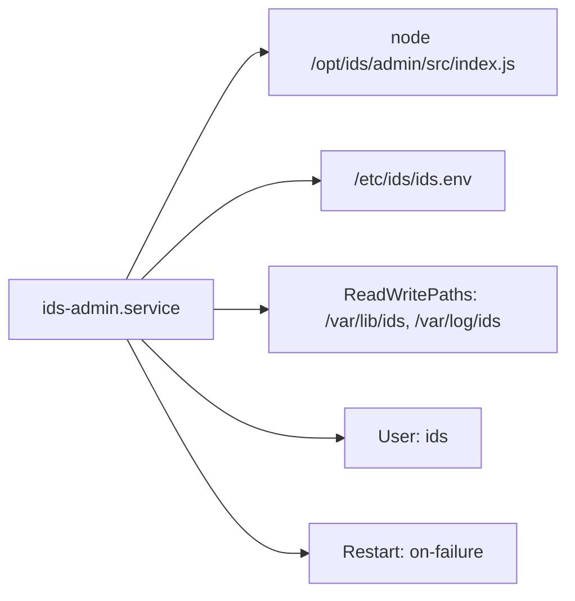
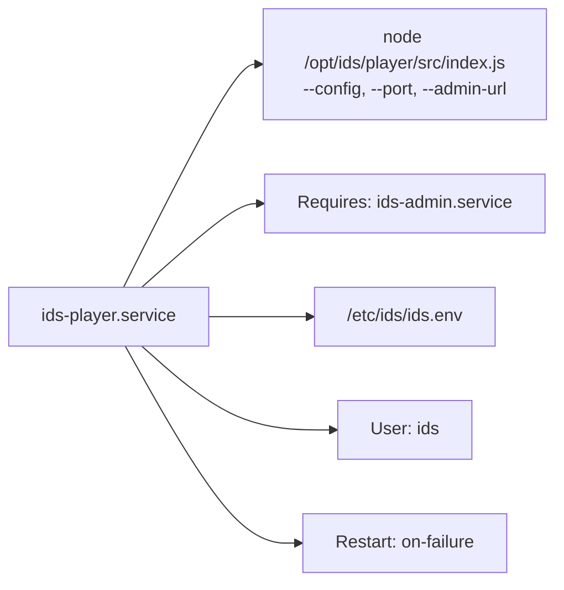

# Raspberry Pi Deployment

> Running IDS on real hardware — from fresh setup to production operations.

---

## Deployment Architecture



---

## File Layout

| Path | Purpose | Owner |
|------|---------|-------|
| `/opt/ids` | Application code (git repo) | `ids:ids` |
| `/etc/ids/ids.env` | Environment configuration | `root:root` |
| `/var/lib/ids/admin` | Persistent admin state + uploaded media | `ids:ids` |
| `/var/log/ids` | Service log output | `ids:ids` |

---

## Fresh Setup

### 1. Create the system user

```bash
sudo useradd --system --home /opt/ids --shell /usr/sbin/nologin ids || true
```

### 2. Create directories

```bash
sudo mkdir -p /opt/ids /etc/ids /var/lib/ids/admin /var/log/ids
sudo chown -R ids:ids /opt/ids /var/lib/ids /var/log/ids
sudo chmod 750 /etc/ids /var/lib/ids /var/log/ids
```

### 3. Install Node.js 20+

Install via your preferred method (nvm, nodesource, etc.) and place the repository at `/opt/ids`.

### 4. Install the environment file

```bash
sudo cp /opt/ids/deploy/pi/env/ids.env /etc/ids/ids.env
sudo chown root:root /etc/ids/ids.env
sudo chmod 640 /etc/ids/ids.env
```

### 5. Install dependencies

```bash
cd /opt/ids
npm --prefix admin install
npm --prefix player install
npm --prefix shared/contract install
```

### 6. Install systemd units

```bash
sudo cp /opt/ids/deploy/pi/systemd/ids-admin.service /etc/systemd/system/
sudo cp /opt/ids/deploy/pi/systemd/ids-player.service /etc/systemd/system/
sudo systemctl daemon-reload
sudo systemctl enable ids-admin.service ids-player.service
```

### 7. Start services

```bash
sudo systemctl start ids-admin.service
sudo systemctl start ids-player.service
```

---

## Environment Configuration

Edit `/etc/ids/ids.env` before starting:

| Variable | Value | Why It Matters |
|----------|-------|----------------|
| `ADMIN_HOST` | `0.0.0.0` | Listen on all interfaces for remote browser access |
| `PLAYER_HOST` | `0.0.0.0` | Same — needed for network display access |
| `ADMIN_PORT` | `8081` | Admin service port |
| `PLAYER_PORT` | `7070` | Player service port |
| `IDS_ADMIN_URL` | `http://127.0.0.1:8081` | How the player reaches admin (local) |
| `IDS_PUBLIC_ADMIN_URL` | `http://raspberrypi.local:8081` | Public URL for media links |
| `IDS_ADMIN_DATA_DIR` | `/var/lib/ids/admin` | Where state and uploads live |
| `IDS_CONFIG` | Path to startup config | Player's initial config file |
| `IDS_DETECTOR_CONFIG` | JSON string (optional) | Motion detection tuning |

**Important:** If `IDS_PUBLIC_ADMIN_URL` points at the wrong hostname, all media URLs in campaigns will be broken for external clients.

**Why `0.0.0.0`?** The default bind host is `127.0.0.1` (localhost only). On the Pi, you need remote browser access — setting `0.0.0.0` makes services listen on the network interface too.

---

## systemd Units

### ids-admin.service



### ids-player.service



The player **depends on admin** — systemd ensures admin starts first.

---

## Smoke Check

Verify both services are healthy:

```bash
cd /opt/ids
./deploy/pi/smoke-check.sh
```

Override the per-request timeout:

```bash
SMOKE_TIMEOUT=10 ./deploy/pi/smoke-check.sh
```

**What it checks:**

| Service | Endpoint | Verifies |
|---------|----------|----------|
| Admin | `/health` | Service is running |
| Admin | `/api/state` | State is readable |
| Admin | `/runtime-config` | Runtime projection works |
| Admin | `/services/runtime-deps.js` | UI assets are served |
| Player | `/health` | Service is running |
| Player | `/current` | State machine is responding |

---

## Common Operations

### Update to latest code

```bash
cd /opt/ids
git pull origin main
npm --prefix admin install
npm --prefix player install
npm --prefix shared/contract install
sudo systemctl restart ids-admin.service ids-player.service
./deploy/pi/smoke-check.sh
```

### Update env or unit files

```bash
sudo cp deploy/pi/env/ids.env /etc/ids/ids.env
sudo cp deploy/pi/systemd/*.service /etc/systemd/system/
sudo systemctl daemon-reload
sudo systemctl restart ids-admin.service ids-player.service
```

### Verify remote access

```bash
# On the Pi — check bind addresses
ss -ltnp | grep ':8081'   # Should show 0.0.0.0:8081
ss -ltnp | grep ':7070'   # Should show 0.0.0.0:7070

# Local health
curl -f http://127.0.0.1:8081/health
curl -f http://127.0.0.1:7070/health

# From another machine
# http://<pi-ip>:8081  →  Admin UI
# http://<pi-ip>:7070  →  Player display
```

### Rollback

```bash
cd /opt/ids
git checkout <previous-known-good-ref>
sudo systemctl restart ids-admin.service ids-player.service
./deploy/pi/smoke-check.sh
```

If you suspect bad state, back it up first:

```bash
sudo cp -a /var/lib/ids/admin /var/lib/ids/admin.backup.$(date +%Y%m%d%H%M%S)
```

---

## Troubleshooting

### Check service status

```bash
sudo systemctl status ids-admin.service
sudo systemctl status ids-player.service
```

### Read logs

```bash
journalctl -u ids-admin.service -n 100 --no-pager
journalctl -u ids-player.service -n 100 --no-pager
```

### Check restart counts

```bash
systemctl show ids-admin.service -p NRestarts
systemctl show ids-player.service -p NRestarts
```

### Reset after restart limit hit

```bash
sudo systemctl reset-failed ids-admin.service
sudo systemctl reset-failed ids-player.service
sudo systemctl restart ids-admin.service ids-player.service
```

### Common issues

| Symptom | Cause | Fix |
|---------|-------|-----|
| Remote browser can't connect | Services bound to `127.0.0.1` | Set `ADMIN_HOST=0.0.0.0` and `PLAYER_HOST=0.0.0.0` |
| Media URLs broken | Wrong `IDS_PUBLIC_ADMIN_URL` | Set to the Pi's reachable hostname |
| Player won't start | Admin not ready yet | Check `ids-admin.service` status first |
| Permission denied on data dir | Wrong ownership | `sudo chown -R ids:ids /var/lib/ids` |

---

## Related Docs

| Document | Description |
|----------|-------------|
| [Architecture Overview](../architecture/overview.md) | System design |
| [Status & Roadmap](../status.md) | Deployment hardening plans |
| [Testing Guide](../testing.md) | Verification commands |
