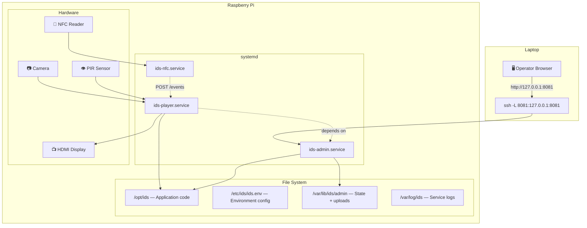
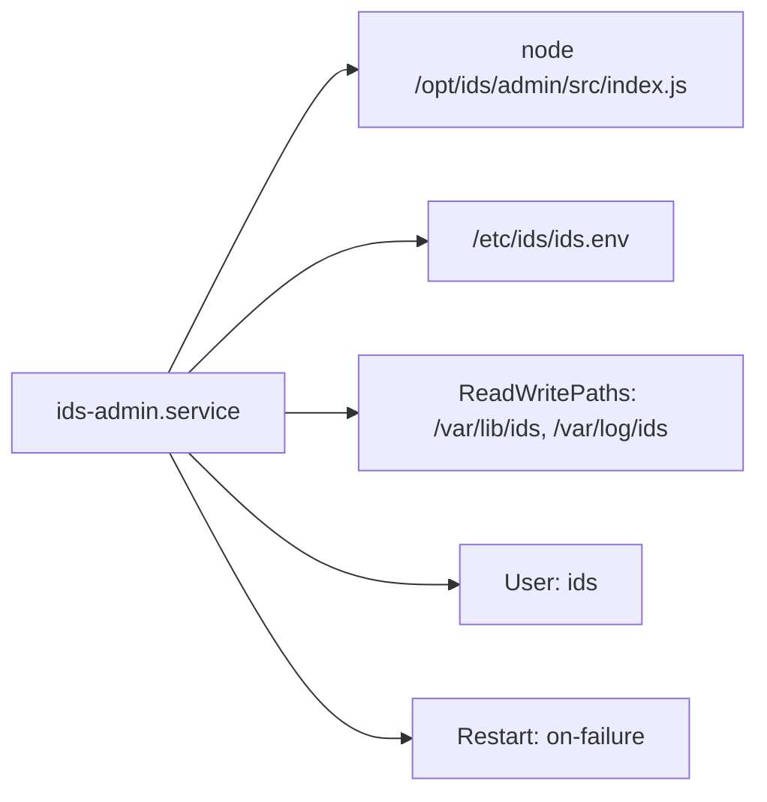
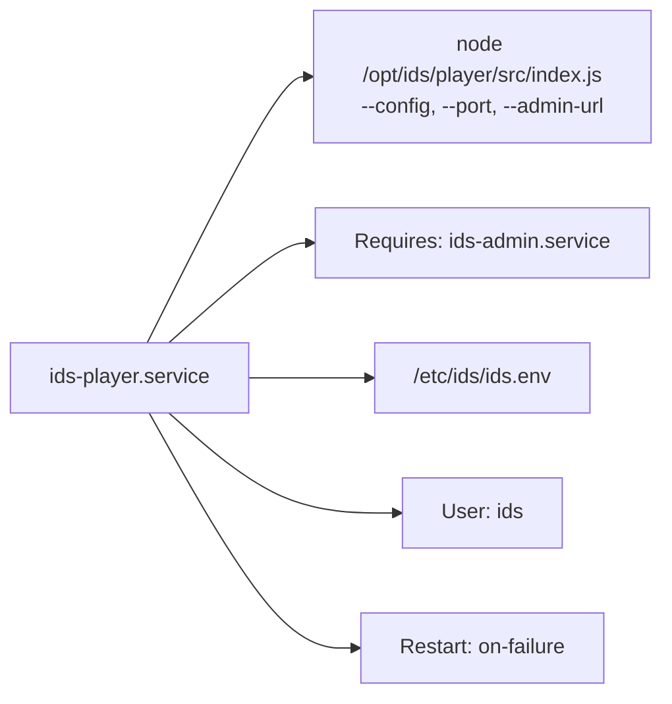
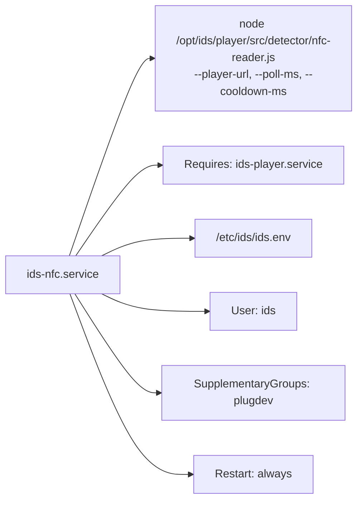

# Raspberry Pi Deployment

> Step-by-step guide to deploy IDS on a Raspberry Pi. Every command is copy-pasteable.
> Each step tells you **where to run it** (laptop or Pi) and **how to verify it worked**.

---

## Deployment Architecture



---

## How It Works (The Big Picture)

- The **Raspberry Pi** runs both services 24/7 and drives the external display.
- Your **laptop** is only used to manage content (create campaigns, upload media) through the admin UI.
- You access the admin UI from your laptop through an **SSH tunnel** — this keeps the admin UI private and secure (no login system exists yet).

```
Laptop browser  -->  SSH tunnel  -->  Pi admin (port 8081)  -->  Pi player (port 7070)  -->  HDMI display
```

---

## What You Need Before Starting

- [ ] A Raspberry Pi (3B+ or newer) with power supply
- [ ] A microSD card (16 GB minimum, 32 GB recommended)
- [ ] An HDMI display + cable
- [ ] Ethernet cable (preferred) or Wi-Fi credentials
- [ ] A laptop with SSH installed (Linux/Mac have it built in; Windows: use PowerShell or WSL)
- [ ] The IDS repository cloned on your laptop

---

## File Layout on the Pi

| Path | What goes there | Owner |
|------|-----------------|-------|
| `/opt/ids` | Application code (copied from laptop) | `ids:ids` |
| `/etc/ids/ids.env` | Environment variables (includes API key) | `root:root` |
| `/var/lib/ids/admin` | Saved state + uploaded media (survives updates) | `ids:ids` |
| `/var/lib/ids/admin/state.json` | Campaign, menu, and settings data | `ids:ids` |
| `/var/lib/ids/admin/students.db` | Student profiles (SQLite database) | `ids:ids` |
| `/var/lib/ids/admin/uploads/` | Uploaded media files | `ids:ids` |
| `/var/log/ids` | Service logs | `ids:ids` |

---

## Step-by-Step Setup

### Step 1 — Flash the SD Card

**Where:** on your laptop.

1. Download and open [Raspberry Pi Imager](https://www.raspberrypi.com/software/)
2. Choose **Raspberry Pi OS (64-bit)** — Bookworm
3. Click the gear icon (or "Edit Settings") and set:
   - **Hostname:** `ids-pi`
   - **Enable SSH:** yes (use password authentication for now)
   - **Username:** `admin` (or whatever you prefer — remember it)
   - **Password:** pick something you will remember
   - **Wi-Fi:** only fill in if you are NOT using Ethernet
4. Flash the SD card
5. Put the SD card in the Pi
6. Plug in Ethernet, HDMI display, then power

Wait about 60 seconds for first boot to finish.

---

### Step 2 — Find the Pi and Connect

**Where:** on your laptop.

Find the Pi's IP address. Try one of these:

```bash
# Option A: if you set hostname to ids-pi
ping ids-pi.local

# Option B: scan your local network (change the subnet if yours is different)
# On Linux/Mac:
arp -a | grep -i "raspberry\|dc:a6\|b8:27\|d8:3a\|2c:cf\|e4:5f"

# Option C: check your router's admin page for connected devices
```

Once you have the IP, SSH in (replace `10.153.57.101` with your Pi's actual IP everywhere below):

```bash
ssh admin@10.153.57.101
```

Type `yes` when asked about the fingerprint, then enter your password.

**Verify:** you see a prompt like `admin@ids-pi:~ $`

---

### Step 3 — Update the Pi

**Where:** on the Pi (through SSH).

```bash
sudo apt update && sudo apt full-upgrade -y
```

Set the timezone:

```bash
sudo timedatectl set-timezone Europe/Paris
```

**Verify:**

```bash
date
```

Should show the correct date and time in your timezone.

Optional — open `raspi-config` to check display/camera settings:

```bash
sudo raspi-config
```

---

### Step 4 — Set Up SSH Key Login (No More Passwords)

**Where:** on your laptop (open a NEW terminal, keep the Pi session open).

Check if you already have an SSH key:

```bash
ls ~/.ssh/id_ed25519.pub
```

If you get "No such file", create one:

```bash
ssh-keygen -t ed25519
```

Press Enter three times to accept defaults (no passphrase is fine for this).

Copy your key to the Pi:

```bash
ssh-copy-id admin@10.153.57.101
```

Enter your Pi password one last time.

**Verify:** this should log you in with NO password prompt:

```bash
ssh admin@10.153.57.101
```

If it still asks for a password, something went wrong. Check:
- `ls ~/.ssh/id_ed25519.pub` exists on the laptop
- `cat ~/.ssh/authorized_keys` on the Pi shows your key

---

### Step 5 — Install Node.js 20

**Where:** on the Pi.

Install prerequisites:

```bash
sudo apt install -y git curl ca-certificates gnupg
```

Add the NodeSource repository and install Node.js 20:

```bash
sudo mkdir -p /etc/apt/keyrings
curl -fsSL https://deb.nodesource.com/gpgkey/nodesource-repo.gpg.key | sudo gpg --dearmor -o /etc/apt/keyrings/nodesource.gpg
echo "deb [signed-by=/etc/apt/keyrings/nodesource.gpg] https://deb.nodesource.com/node_20.x nodistro main" | sudo tee /etc/apt/sources.list.d/nodesource.list
sudo apt update
sudo apt install -y nodejs
```

**Verify:**

```bash
node -v
```

Must show `v20.x.x` or higher. **Do NOT continue if it shows v18 or lower.**

```bash
npm -v
```

Must print a version number (any is fine).

If the Pi will show the player in a browser window on its own desktop, also install Chromium:

```bash
sudo apt install -y chromium-browser
```

---

### Step 6 — Create the IDS User and Directories

**Where:** on the Pi.

Create a dedicated system user (no login shell, just for running the services):

```bash
sudo useradd --system --home /opt/ids --shell /usr/sbin/nologin ids
```

If it says "user already exists", that's fine — keep going.

Create all required directories:

```bash
sudo mkdir -p /opt/ids /etc/ids /var/lib/ids/admin /var/log/ids
sudo chown -R ids:ids /opt/ids /var/lib/ids /var/log/ids
sudo chmod 750 /etc/ids /var/lib/ids /var/log/ids
```

**Verify:**

```bash
id ids
```

Should show the `ids` user. Then:

```bash
ls -la /opt/ids /etc/ids /var/lib/ids /var/log/ids
```

All directories should exist and show correct owners.

---

### Step 7 — Copy the Code to the Pi

**Where:** start on your laptop.

First, on your laptop, go to your IDS repo and make sure you're on the right branch:

```bash
cd ~/School/S8/PROJ/Project/ids
git status
```

Now copy the code to the Pi (this sends everything except `.git` and `node_modules`):

```bash
rsync -av --delete \
  --exclude '.git' \
  --exclude 'node_modules' \
  ~/School/S8/PROJ/Project/ids/ admin@10.153.57.101:/tmp/ids-copy/
```

**Where:** now switch to the Pi (SSH in if not already connected).

Move the files to their final location:

```bash
sudo rm -rf /opt/ids/*
sudo cp -a /tmp/ids-copy/. /opt/ids/
sudo chown -R ids:ids /opt/ids
rm -rf /tmp/ids-copy
```

**Verify:**

```bash
ls /opt/ids/
```

You should see: `admin`, `player`, `shared`, `deploy`, `Makefile`, etc.

---

### Step 8 — Install the Environment File

**Where:** on the Pi.

```bash
sudo cp /opt/ids/deploy/pi/env/ids.env /etc/ids/ids.env
sudo chown root:root /etc/ids/ids.env
sudo chmod 640 /etc/ids/ids.env
```

Now set a real API key (don't use the default `admin` in production):

```bash
sudo nano /etc/ids/ids.env
```

Find the `IDS_ADMIN_API_KEY` line and change it to a strong, unique value:

```
IDS_ADMIN_API_KEY=your-secret-production-key-here
```

Save and exit (`Ctrl+O`, `Ctrl+X`).

**Verify:**

```bash
sudo cat /etc/ids/ids.env
```

You should see variables like `ADMIN_HOST=127.0.0.1`, `ADMIN_PORT=8081`, `IDS_ADMIN_API_KEY=your-secret-...`, etc.

---

### Step 9 — Install Node Dependencies

**Where:** on the Pi.

```bash
cd /opt/ids
sudo -u ids npm --prefix admin install
sudo -u ids npm --prefix player install
sudo -u ids npm --prefix shared/contract install
```

> We use `sudo -u ids` so the `node_modules` directories are owned by the `ids` user. If npm complains about permissions, run without `sudo -u ids` and then fix ownership:
> ```bash
> npm --prefix admin install
> npm --prefix player install
> npm --prefix shared/contract install
> sudo chown -R ids:ids /opt/ids
> ```

**Verify:**

```bash
ls /opt/ids/admin/node_modules/ | head -5
ls /opt/ids/player/node_modules/ | head -5
```

Both should show installed packages (not empty).

---

### Step 10 — Install NFC Reader (Optional)

**Where:** on the Pi.

If you have an NFC reader (e.g. ACR122U), install `libnfc`:

```bash
sudo apt install -y libnfc-bin
```

**Verify:**

```bash
nfc-list
```

If a reader is connected, it should show the device. If not connected, it will say "No NFC device found" — that's fine, the service will retry.

Add the `ids` user to the `plugdev` group so it can access the USB reader:

```bash
sudo usermod -aG plugdev ids
```

---

### Step 11 — Install and Enable systemd Services

**Where:** on the Pi.

```bash
sudo cp /opt/ids/deploy/pi/systemd/ids-admin.service /etc/systemd/system/
sudo cp /opt/ids/deploy/pi/systemd/ids-player.service /etc/systemd/system/
sudo cp /opt/ids/deploy/pi/systemd/ids-nfc.service /etc/systemd/system/
sudo systemctl daemon-reload
sudo systemctl enable ids-admin.service ids-player.service ids-nfc.service
```

**Verify:**

```bash
sudo systemctl is-enabled ids-admin.service
sudo systemctl is-enabled ids-player.service
sudo systemctl is-enabled ids-nfc.service
```

All should say `enabled`. (The NFC service will start but log a warning if no reader is attached.)

---

### Step 12 — Start the Services

**Where:** on the Pi.

Start admin first (player and NFC depend on it):

```bash
sudo systemctl start ids-admin.service
```

Wait 3 seconds, then start the player and NFC reader:

```bash
sudo systemctl start ids-player.service
sudo systemctl start ids-nfc.service
```

**Verify all are running:**

```bash
sudo systemctl status ids-admin.service --no-pager
sudo systemctl status ids-player.service --no-pager
sudo systemctl status ids-nfc.service --no-pager
```

All should show **`active (running)`** in green. (NFC may show a warning if no reader is attached — that's OK.)

If any shows `failed`, check the logs:

```bash
journalctl -u ids-admin.service -n 50 --no-pager
journalctl -u ids-player.service -n 50 --no-pager
journalctl -u ids-nfc.service -n 50 --no-pager
```

---

### Step 13 — Run the Smoke Check

**Where:** on the Pi.

```bash
cd /opt/ids
sudo -u ids bash ./deploy/pi/smoke-check.sh
```

You should see:

```
[smoke] admin health
[smoke] admin state
[smoke] admin runtime-config
[smoke] admin static asset
[smoke] player health
[smoke] player current state
[smoke] ids-nfc service is running       (or WARNING if no reader attached)
[smoke] all checks passed
```

If any check fails, the script stops and prints an error. See [Troubleshooting](#troubleshooting) below.

If checks are timing out (slow Pi), increase the timeout:

```bash
SMOKE_TIMEOUT=15 sudo -u ids bash ./deploy/pi/smoke-check.sh
```

---

### Step 14 — Access Admin from Your Laptop

**Where:** on your laptop.

Open the SSH tunnel:

```bash
ssh -L 8081:127.0.0.1:8081 admin@10.153.57.101
```

Leave this terminal open. Now open your browser and go to:

```
http://127.0.0.1:8081
```

You should see the IDS admin interface.

**If the page doesn't load:**
- Is the SSH tunnel terminal still open? (don't close it)
- On the Pi, is the admin service running? (`sudo systemctl status ids-admin.service`)
- Is it bound to the right port? (`ss -ltnp | grep 8081` on the Pi — should show `127.0.0.1:8081`)

---

## You're Done! Setup Complete.

The Pi will now:
- Auto-start all three services on boot (admin, player, NFC reader)
- Auto-restart them if they crash
- Show the player display on the connected HDMI screen
- Read NFC cards when a reader is attached

---

## I Changed Some Code, Now What?

Once the first-time setup is done (Steps 1–13), you only need to repeat **3 things** to push a code change. Skip everything else.

### On your laptop

**1. Sync your code to the Pi:**

```bash
cd ~/School/S8/PROJ/Project/ids
rsync -av --delete --exclude '.git' --exclude 'node_modules' ./ admin@10.153.57.101:/tmp/ids-copy/
```

### On the Pi (SSH in)

**2. Replace the code and restart:**

```bash
# Stop
sudo systemctl stop ids-nfc.service ids-player.service ids-admin.service

# Replace code
sudo rm -rf /opt/ids/*
sudo cp -a /tmp/ids-copy/. /opt/ids/
sudo chown -R ids:ids /opt/ids
rm -rf /tmp/ids-copy

# Reinstall dependencies (only needed if you changed package.json)
cd /opt/ids
npm --prefix admin install
npm --prefix player install
npm --prefix shared/contract install
sudo chown -R ids:ids /opt/ids

# Start
sudo systemctl start ids-admin.service
sudo systemctl start ids-player.service
sudo systemctl start ids-nfc.service
```

**3. Verify it works:**

```bash
sudo systemctl status ids-admin.service --no-pager
sudo systemctl status ids-player.service --no-pager
sudo systemctl status ids-nfc.service --no-pager
cd /opt/ids && sudo -u ids bash ./deploy/pi/smoke-check.sh
```

That's it. Your data (campaigns, uploads) in `/var/lib/ids/admin` is untouched — only the code in `/opt/ids` gets replaced.

### What you do NOT need to redo

| Step | Why you can skip it |
|------|---------------------|
| Flash SD card | Only done once |
| Update Pi / install Node | Already installed |
| Create `ids` user | Already exists |
| Create directories | Already exist |
| Install env file | Already at `/etc/ids/ids.env` (unless you changed `deploy/pi/env/ids.env`) |
| Install systemd units | Already at `/etc/systemd/system/` (unless you changed the `.service` files). Remember to also copy `ids-nfc.service` if it changed. |
| Set up SSH keys | Already done |

### If you also changed the .service or .env files

Add these commands after replacing the code, before starting services:

```bash
sudo cp /opt/ids/deploy/pi/env/ids.env /etc/ids/ids.env
sudo cp /opt/ids/deploy/pi/systemd/*.service /etc/systemd/system/
sudo systemctl daemon-reload
```

---

## Environment Configuration Reference

The environment file is at `/etc/ids/ids.env` on the Pi. Here is what each variable does:

| Variable | Default Value | What It Does |
|----------|---------------|--------------|
| `ADMIN_HOST` | `127.0.0.1` | IP the admin service listens on. Keep `127.0.0.1` for security. |
| `ADMIN_PORT` | `8081` | Port for the admin service. |
| `PLAYER_HOST` | `127.0.0.1` | IP the player service listens on. |
| `PLAYER_PORT` | `7070` | Port for the player service. |
| `IDS_ADMIN_URL` | `http://127.0.0.1:8081` | URL the player uses to reach the admin API. |
| `IDS_PUBLIC_ADMIN_URL` | `http://127.0.0.1:8081` | Base URL for media file links in campaigns. |
| `IDS_ADMIN_DATA_DIR` | `/var/lib/ids/admin` | Where state and uploaded files are saved. |
| `IDS_CONFIG` | Path to JSON file | Player startup configuration file. |
| `IDS_DETECTOR_CONFIG` | _(empty)_ | Optional JSON for motion detection tuning. |
| `NFC_POLL_MS` | `800` | How often the NFC reader polls for cards (milliseconds). |
| `NFC_COOLDOWN_MS` | `3000` | Minimum time between accepting the same card tap. |
| `IDS_ADMIN_API_KEY` | _(must be set)_ | API key required for all admin mutation endpoints. The browser admin UI prompts for this key on first visit. **Use a strong, unique value in production.** |
| `NODE_ENV` | `production` | Node environment (`production` on Pi, `development` locally). |

**Critical rules:**
- `IDS_PUBLIC_ADMIN_URL` must match the URL the player can actually reach. On the Pi, both services run locally, so `http://127.0.0.1:8081` is correct. If you change this to something wrong, uploaded media will not display.

To edit the env file:

```bash
sudo nano /etc/ids/ids.env
```

After editing, restart both services:

```bash
sudo systemctl restart ids-admin.service ids-player.service
```

---

## Daily Use

### Viewing the Player Display (on the Pi)

The Pi display should show the player automatically. If you need to open it manually on the Pi desktop:

```bash
chromium-browser --kiosk http://127.0.0.1:7070
```

(`--kiosk` = full-screen, no toolbar)

### Managing Content (from your laptop)

1. Open a terminal and start the SSH tunnel:

```bash
ssh -L 8081:127.0.0.1:8081 admin@10.153.57.101
```

2. Open your browser to `http://127.0.0.1:8081`

3. From there you can:
   - Create and edit campaigns
   - Upload media (images, videos)
   - Publish changes to the player
   - Manage students

4. **Keep the SSH terminal open** the entire time you are working. Closing it kills the tunnel.

---

## systemd Units

### ids-admin.service



### ids-player.service



### ids-nfc.service



The dependency chain is: **admin -> player -> NFC reader**. systemd ensures they start in order and stops dependents if a dependency goes down.

---

## Smoke Check Details

```bash
cd /opt/ids
sudo -u ids bash ./deploy/pi/smoke-check.sh
```

| # | Service | Endpoint | What It Proves |
|---|---------|----------|----------------|
| 1 | Admin | `/health` | Admin process is alive |
| 2 | Admin | `/api/state` | State file is readable |
| 3 | Admin | `/runtime-config` | Config projection works |
| 4 | Admin | `/services/runtime-deps.js` | UI static files are served |
| 5 | Player | `/health` | Player process is alive |
| 6 | Player | `/current` | State machine is responding |
| 7 | NFC | systemd status | NFC reader service is active (warning if no reader attached) |

---

## Common Operations

### Deploying New Code (Update)

**Where:** start on your laptop, finish on the Pi.

**On the laptop** — sync latest code to the Pi:

```bash
cd ~/School/S8/PROJ/Project/ids
rsync -av --delete \
  --exclude '.git' \
  --exclude 'node_modules' \
  ./ admin@10.153.57.101:/tmp/ids-copy/
```

**On the Pi** — apply the update:

```bash
# Stop services first
sudo systemctl stop ids-nfc.service ids-player.service ids-admin.service

# Replace code (keeps your data in /var/lib/ids safe)
sudo rm -rf /opt/ids/*
sudo cp -a /tmp/ids-copy/. /opt/ids/
sudo chown -R ids:ids /opt/ids
rm -rf /tmp/ids-copy

# Reinstall dependencies
cd /opt/ids
npm --prefix admin install
npm --prefix player install
npm --prefix shared/contract install
sudo chown -R ids:ids /opt/ids

# Copy updated service/env files (in case they changed)
sudo cp /opt/ids/deploy/pi/env/ids.env /etc/ids/ids.env
sudo cp /opt/ids/deploy/pi/systemd/*.service /etc/systemd/system/
sudo systemctl daemon-reload

# Start services again
sudo systemctl start ids-admin.service
sudo systemctl start ids-player.service
sudo systemctl start ids-nfc.service

# Verify
sudo systemctl status ids-admin.service --no-pager
sudo systemctl status ids-player.service --no-pager
sudo systemctl status ids-nfc.service --no-pager
cd /opt/ids && sudo -u ids bash ./deploy/pi/smoke-check.sh
```

### Quick Restart (No Code Change)

**Where:** on the Pi.

```bash
sudo systemctl restart ids-admin.service ids-player.service ids-nfc.service
```

### Update Only the Environment File

**Where:** on the Pi.

```bash
sudo nano /etc/ids/ids.env
# make your changes, save with Ctrl+O, exit with Ctrl+X
sudo systemctl restart ids-admin.service ids-player.service ids-nfc.service
```

### Check That Services Are Only Listening Locally

**Where:** on the Pi.

```bash
ss -ltnp | grep ':8081'
ss -ltnp | grep ':7070'
```

Both should show `127.0.0.1` — NOT `0.0.0.0`. If you see `0.0.0.0`, the admin UI is exposed on the network (see [Less Secure Alternative](#less-secure-alternative)).

### Back Up Your Data Before Risky Changes

**Where:** on the Pi.

```bash
sudo cp -a /var/lib/ids/admin /var/lib/ids/admin.backup.$(date +%Y%m%d%H%M%S)
```

This copies all state and uploaded media. To restore from a backup:

```bash
# List backups
ls /var/lib/ids/

# Restore (replace the timestamp with yours)
sudo systemctl stop ids-admin.service ids-player.service
sudo rm -rf /var/lib/ids/admin
sudo cp -a /var/lib/ids/admin.backup.20260314120000 /var/lib/ids/admin
sudo chown -R ids:ids /var/lib/ids/admin
sudo systemctl start ids-admin.service ids-player.service
```

---

## Less Secure Alternative (LAN Access Without SSH Tunnel)

If you want direct browser access from your laptop without the SSH tunnel, you can expose admin on the local network. **Only do this on a trusted, private network.**

Edit `/etc/ids/ids.env` on the Pi:

```bash
sudo nano /etc/ids/ids.env
```

Change these three lines:

```
ADMIN_HOST=0.0.0.0
PLAYER_HOST=0.0.0.0
IDS_PUBLIC_ADMIN_URL=http://10.153.57.101:8081
```

(Replace `10.153.57.101` with your Pi's actual IP.)

Then restart:

```bash
sudo systemctl restart ids-admin.service ids-player.service ids-nfc.service
```

Now you can open `http://10.153.57.101:8081` directly in your laptop browser — no SSH tunnel needed.

**Warning:** anyone on your network can access the admin UI. There is no login/password protection.

---

## Troubleshooting

### 1. Check if services are running

```bash
sudo systemctl status ids-admin.service --no-pager
sudo systemctl status ids-player.service --no-pager
```

Look for `active (running)`. If you see `failed` or `inactive`, read the logs.

### 2. Read the logs

```bash
# Last 100 lines of admin logs
journalctl -u ids-admin.service -n 100 --no-pager

# Last 100 lines of player logs
journalctl -u ids-player.service -n 100 --no-pager

# Follow logs in real time (Ctrl+C to stop)
journalctl -u ids-admin.service -f
```

### 3. Service keeps crashing (restart limit hit)

If a service crashes 5 times in 60 seconds, systemd stops trying. Reset and try again:

```bash
sudo systemctl reset-failed ids-admin.service ids-player.service ids-nfc.service
sudo systemctl start ids-admin.service
sudo systemctl start ids-player.service
sudo systemctl start ids-nfc.service
```

Then read the logs to find out why it crashed.

### 4. Check restart count

```bash
systemctl show ids-admin.service -p NRestarts
systemctl show ids-player.service -p NRestarts
systemctl show ids-nfc.service -p NRestarts
```

### Common Problems and Fixes

| What's Wrong | Why | How to Fix |
|---|---|---|
| Laptop can't open `http://127.0.0.1:8081` | SSH tunnel is not running | Open a terminal and run `ssh -L 8081:127.0.0.1:8081 admin@10.153.57.101` |
| Images/videos don't show in the player | `IDS_PUBLIC_ADMIN_URL` is wrong | Edit `/etc/ids/ids.env`, set `IDS_PUBLIC_ADMIN_URL=http://127.0.0.1:8081`, restart services |
| Player won't start | Admin service isn't running yet | Run `sudo systemctl start ids-admin.service` first, wait 3 seconds, then start player |
| "Permission denied" errors in logs | Wrong file ownership | Run `sudo chown -R ids:ids /opt/ids /var/lib/ids /var/log/ids` |
| NFC tap not recognized | NFC service not running or no reader attached | `sudo systemctl status ids-nfc.service --no-pager` and `journalctl -u ids-nfc.service -n 50 --no-pager` |
| `node: command not found` | Node.js not installed | Go back to [Step 5](#step-5--install-nodejs-20) |
| `npm install` fails with network errors | Pi has no internet | Check `ping google.com` — fix DNS or network first |
| smoke-check.sh says "permission denied" | Script not executable or wrong user | Run with `sudo -u ids bash ./deploy/pi/smoke-check.sh` |
| Services start but ports show `0.0.0.0` | `ADMIN_HOST`/`PLAYER_HOST` set to `0.0.0.0` | Edit `/etc/ids/ids.env`, set both to `127.0.0.1`, restart services |

---

## Quick Reference Card

Copy-paste cheat sheet for day-to-day commands.

```bash
# --- ON YOUR LAPTOP ---

# SSH into the Pi
ssh admin@10.153.57.101

# Open admin tunnel (keep this terminal open)
ssh -L 8081:127.0.0.1:8081 admin@10.153.57.101
# Then open http://127.0.0.1:8081 in your browser

# Deploy new code to Pi
cd ~/School/S8/PROJ/Project/ids
rsync -av --delete --exclude '.git' --exclude 'node_modules' ./ admin@10.153.57.101:/tmp/ids-copy/

# --- ON THE PI ---

# Check service status
sudo systemctl status ids-admin.service --no-pager
sudo systemctl status ids-player.service --no-pager
sudo systemctl status ids-nfc.service --no-pager

# Restart all services
sudo systemctl restart ids-admin.service ids-player.service ids-nfc.service

# Read logs
journalctl -u ids-admin.service -n 100 --no-pager
journalctl -u ids-player.service -n 100 --no-pager
journalctl -u ids-nfc.service -n 100 --no-pager

# Run smoke check
cd /opt/ids && sudo -u ids bash ./deploy/pi/smoke-check.sh

# Apply code update after rsync
sudo systemctl stop ids-nfc.service ids-player.service ids-admin.service
sudo rm -rf /opt/ids/* && sudo cp -a /tmp/ids-copy/. /opt/ids/ && sudo chown -R ids:ids /opt/ids && rm -rf /tmp/ids-copy
cd /opt/ids && npm --prefix admin install && npm --prefix player install && npm --prefix shared/contract install && sudo chown -R ids:ids /opt/ids
sudo systemctl start ids-admin.service && sudo systemctl start ids-player.service && sudo systemctl start ids-nfc.service

# Back up data
sudo cp -a /var/lib/ids/admin /var/lib/ids/admin.backup.$(date +%Y%m%d%H%M%S)

# Edit environment
sudo nano /etc/ids/ids.env
sudo systemctl restart ids-admin.service ids-player.service
```

---

## Testing on the Pi

After deploying, verify the full system works end-to-end:

### Automated Checks

```bash
# Run the smoke check (tests all service endpoints)
cd /opt/ids && sudo -u ids bash ./deploy/pi/smoke-check.sh

# Run the test suite on the Pi (optional — primarily for CI, but works here too)
cd /opt/ids && make test-all
```

### Manual End-to-End Test

1. Open the player display (on Pi HDMI or via `http://127.0.0.1:7070` in Chromium)
2. Verify IDLE state shows welcome content
3. Trigger movement (wave hand, or use debug mode: `http://127.0.0.1:7070?debug=1`)
4. Verify MENU state shows visitor/student cards
5. Test visitor flow: click "I'm visiting" → verify visitor content appears
6. Wait for inactivity timeout → verify return to IDLE
7. If NFC reader is connected: tap a registered student card → verify student content
8. If NFC reader is connected: tap an unregistered card → verify "Card not recognized" banner
9. Open admin UI via SSH tunnel: `ssh -L 8081:127.0.0.1:8081 admin@<pi-ip>` → open `http://127.0.0.1:8081`
10. Verify admin UI loads, prompts for API key, and shows campaigns

### Checklist

| Check | Command / Action | Expected |
|-------|-----------------|----------|
| Admin alive | `curl http://127.0.0.1:8081/health` | `{"status":"ok",...}` |
| Player alive | `curl http://127.0.0.1:7070/health` | `{"status":"ok",...}` |
| Player state | `curl http://127.0.0.1:7070/current` | `{"state":"IDLE",...}` |
| NFC service | `sudo systemctl status ids-nfc.service` | `active (running)` |
| Ports local only | `ss -ltnp | grep ':8081'` | Shows `127.0.0.1` |
| API key works | `curl -X POST http://127.0.0.1:8081/api/campaigns -H 'Authorization: Bearer wrong'` | `401` |
| Smoke check | `sudo -u ids bash ./deploy/pi/smoke-check.sh` | All checks passed |

---

## Related Docs

| Document | Description |
|----------|-------------|
| [Local Development Guide](local-development.md) | Run and test on your laptop |
| [Architecture Overview](../architecture/overview.md) | System design |
| [Status & Roadmap](../status.md) | Deployment hardening plans |
| [Testing Guide](../testing.md) | Verification commands |
