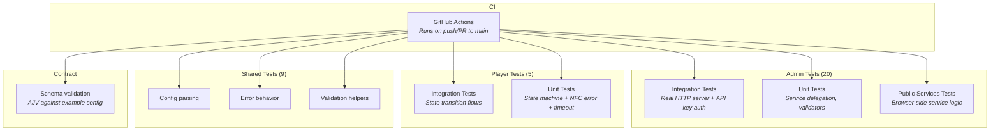

# Testing & Verification

> How to run tests, what they cover, and how to verify the system is healthy.

---

## Quick Reference

```bash
# Everything at once
make test-all

# Individual suites
npm --prefix admin test        # Admin unit + integration
npm --prefix player test       # Player unit + integration
node --test shared/test/*.test.js  # Shared utilities

# Full verification (tests + contract validation)
make verify-all

# Just validate the JSON contract
make validate
```

---

## Test Architecture



---

## Admin Test Suite

```bash
npm --prefix admin test
```

### Coverage Areas

| Area | Test File | What It Verifies |
|------|-----------|-----------------|
| HTTP API | `test/integration/admin-api.test.js` | Full request/response cycle for all endpoints, API key auth (401 on missing/bad key) |
| Storage flow | `test/integration/storage-flow.test.js` | Repository read/write, state mutations, async batching, SQLite student profile storage |
| Service delegation | `test/unit/services.test.js` | Services call storage correctly, return proper shapes |
| Validators | `test/unit/validators.test.js` | Campaign item validation, student data validation |
| Browser services | `test/unit/public-services.test.js` | Client-side service logic (orchestrator, actions, editor state) |

### Integration Test Note

Admin integration tests start a **real local HTTP server** bound to `127.0.0.1`. In restricted sandboxes that forbid local socket binding, these tests fail with `listen EPERM` — this is a sandbox limitation, not a repo bug.

---

## Player Test Suite

```bash
npm --prefix player test
```

### Coverage Areas

| Area | Test File | What It Verifies |
|------|-----------|-----------------|
| State flows | `test/integration/state-flow.test.js` | Full IDLE → MENU → VISITOR/STUDENT transitions |
| State machine | `test/unit/state-machine.test.js` | Event handling, timeout logic, NFC error tracking, presence/NFC keepalive, config application |

---

## Shared Test Suite

```bash
node --test shared/test/*.test.js
```

### Coverage Areas

| Area | Test File | What It Verifies |
|------|-----------|-----------------|
| Config | `test/config.test.js` | Environment variable parsing, defaults, typed views |
| Errors | `test/errors.test.js` | ValidationError shape and behavior |
| Validation | `test/validation.test.js` | Field validators, edge cases |

---

## Contract Validation

```bash
make validate
```

Runs the bundled example config (`shared/contract/examples/config.welcome.json`) against the JSON Schema (`shared/contract/schema/config.schema.json`) using AJV.

---

## Current Status

| Suite | Tests | Status |
|-------|-------|--------|
| Admin tests | 20 | **Passing** |
| Player tests | 5 | **Passing** |
| Shared tests | 9 | **Passing** |
| Contract validation | — | **Passing** |
| **Total** | **34** | **All passing** |

CI runs automatically on every push and pull request to `main`/`master` via GitHub Actions.

---

## Verification Checklist

When modifying documentation or code, verify:

| Check | How |
|-------|-----|
| Every documented route exists | Cross-reference with `router.js` |
| Every documented env var exists | Check `.env.example`, `shared/config`, deploy env files |
| Every documented command works | Run the command from `Makefile` or package scripts |
| Internal markdown links resolve | Click them / check file paths |
| Tests still pass | `make test-all` |

---

## Related Docs

| Document | Description |
|----------|-------------|
| [Architecture Overview](architecture/overview.md) | System design context |
| [Status & Roadmap](status.md) | What's tested, what's not yet |
| [Deployment Guide](operations/deployment-pi.md) | Smoke checks on the Pi |
