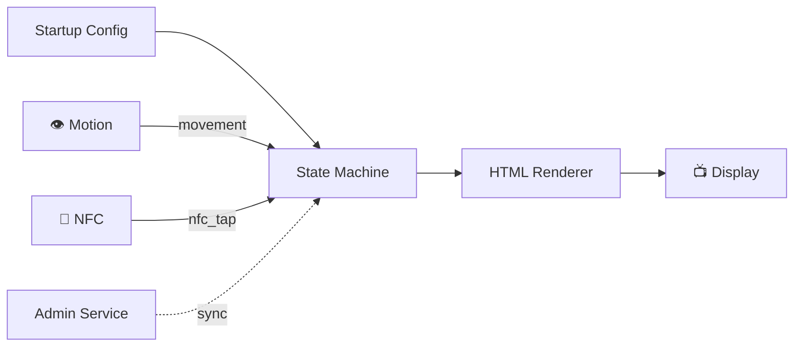
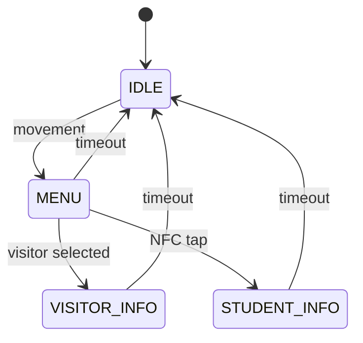

# Player Service

> The IDS display runtime — renders content and reacts to motion, NFC, and user interaction.

---

## What It Does



- Loads a startup config and renders full-screen signage
- Tracks display state with a finite state machine (IDLE → MENU → VISITOR/STUDENT)
- Accepts events from motion sensors, NFC readers, and manual input
- Optionally syncs live config and student campaigns from admin

---

## Quick Start

```bash
# From ids/ root
make run-player             # Start on http://127.0.0.1:7070
npm --prefix player test    # Run all tests
```

---

## State Machine



---

## Key Entrypoints

| File | Purpose |
|------|---------|
| [src/index.js](src/index.js) | Entry point — CLI args + config loading |
| [src/server.js](src/server.js) | Dependency assembly + HTTP server |
| [src/router.js](src/router.js) | Route table |
| [src/services/state-machine.js](src/services/state-machine.js) | Core state machine logic |

---

## Documentation

| Document | Description |
|----------|-------------|
| [Architecture](../docs/architecture/player.md) | State machine, events, rendering, NFC flow |
| [API Reference](../docs/api/player.md) | Every endpoint with examples |
| [Testing](../docs/testing.md) | Test suites and coverage |
