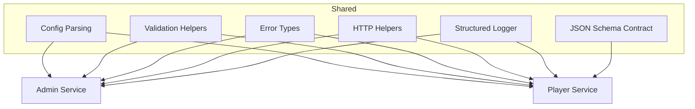

# Shared Package

> The common ground — config, validation, errors, logging, and the runtime config contract.

---

## What It Provides



---

## Module Map

| Module | File | Purpose |
|--------|------|---------|
| Config | [config/index.js](config/index.js) | Environment variable parsing + typed views |
| Validation | [validation/index.js](validation/index.js) | Field-level validators |
| Errors | [errors/index.js](errors/index.js) | `ValidationError` type |
| HTTP Helpers | [utils/http-helpers.js](utils/http-helpers.js) | JSON/text responses, body parsing, HTML escape |
| Logger | [utils/logger.js](utils/logger.js) | Structured JSON logging |
| Contract | [contract/schema/config.schema.json](contract/schema/config.schema.json) | Runtime config JSON Schema |

---

## Quick Start

```bash
# Validate the contract example
make validate

# Run shared tests
node --test shared/test/*.test.js
```

---

## Documentation

| Document | Description |
|----------|-------------|
| [Architecture](../docs/architecture/shared.md) | Module details, dependency map, contract flow |
| [Testing](../docs/testing.md) | Test suites and coverage |
